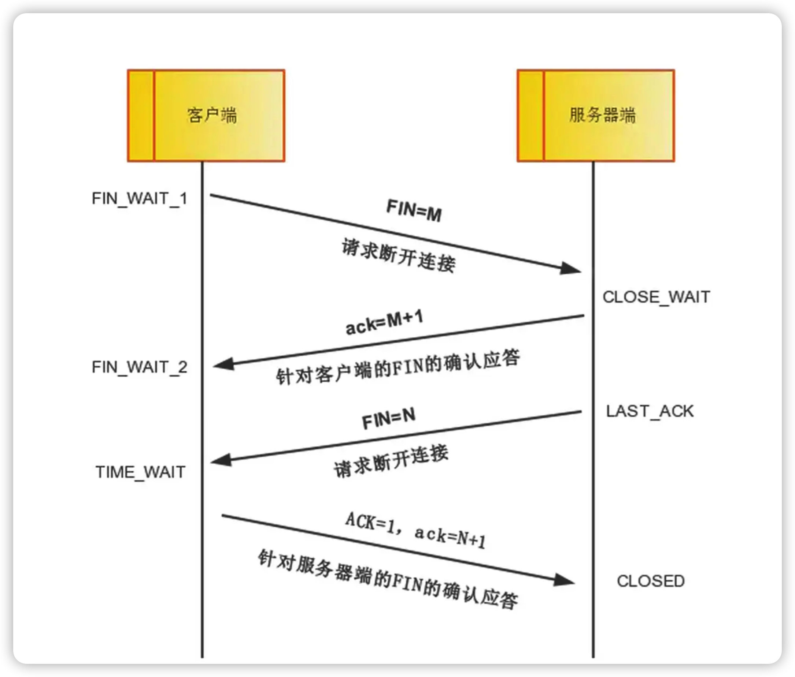

### TCP 三次握手

- 第一次 客户端向服务端发送**连接请求**

客户端向服务端发送连接请求报文段。该报文段中包含自身的数据通讯初始序号。请求发送后，客户端便进入 `SYN-SENT` 状态。

- 第二次 服务端**确认接收**客户端的连接请求，并向客户端发送**连接请求**

服务端收到连接请求报文段后，如果同意连接，则会发送一个应答，该应答中也会包含自身的数据通讯初始序号，发送完成后便进入 `SYN-RECEIVED` 状态。

- 第三次 客户端**确认接收**服务端的连接请求，连接**建立成功**

当客户端收到连接同意的应答后，还要向服务端发送一个确认报文。客户端发完这个报文段后便进入 `ESTABLISHED` 状态，服务端收到这个应答后也进入 `ESTABLISHED` 状态，此时连接建立成功。

### TCP 四次挥手

- 第一次

若客户端 A 认为数据发送完成，则它需要向服务端 B 发送连接释放请求。

- 第二次

B 收到连接释放请求后，会告诉应用层要释放 TCP 链接。然后会发送 ACK 包，并进入 CLOSE_WAIT 状态，此时表明 A 到 B 的连接已经释放，不再接收 A 发的数据了。但是因为 TCP 连接是双向的，所以 B 仍旧可以发送数据给 A。

- 第三次

B 如果此时还有没发完的数据会继续发送，完毕后会向 A 发送连接释放请求，然后 B 便进入 LAST-ACK 状态。

PS：通过延迟确认的技术（通常有时间限制，否则对方会误认为需要重传），可以将第二次和第三次握手合并，延迟 ACK 包的发送。

- 第四次

A 收到释放请求后，向 B 发送确认应答，此时 A 进入 TIME-WAIT 状态。该状态会持续 2MSL（最长报文段寿命，指报文段在网络中生存的时间，超时会被抛弃） 时间，若该时间段内没有 B 的重发请求的话，就进入 CLOSED 状态。当 B 收到确认应答后，也便进入 CLOSED 状态。

### TCP 泛洪攻击

我们已经知道，TCP 只有经过三次握手才能连接，而 SYN 泛洪攻击就是针对 TCP 握手过程进行攻击：

- 攻击者发送大量的 SYN 包给服务器（第一次握手成功）
- 服务器回应(SYN + ACK）包（第二次握手成功）
- 但是攻击者不回应 ACK 包（第三次握手不进行）

导致服务器存在大量的半开连接，这些半连接可以耗尽服务器资源，使被攻击服务器无法再响应正常 TCP 连接，从而达到攻击的目的

幸运的是，一种称为 SYN cookie 的有效防御现在已部署在大多数主要的操作系统中：

- 在客户端发送 SYN 报文给服务器（第一次握手），服务端收到连接请求报文段后，服务器不会为此SYN创建半开连接，而是生成一个序列号（所谓的 cookie）一起发送给客户端（第二次握手），在这个阶段，服务器不会为该连接分配任何资源
- 客户端返回 ACK 报文给服务器（第三次握手），服务器会验证这个 cookie 值，只有验证成功才创建 TCP 连接，分配资源
- 如果客户端没有返回 ACK 报文给服务器，也不会对服务器造成任何的伤害，因为服务器没有分配任何资源给它
