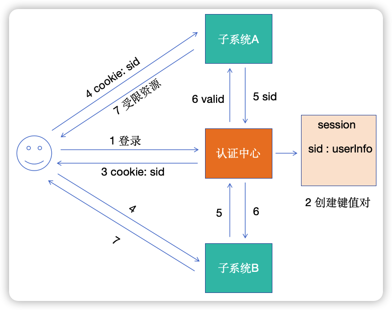
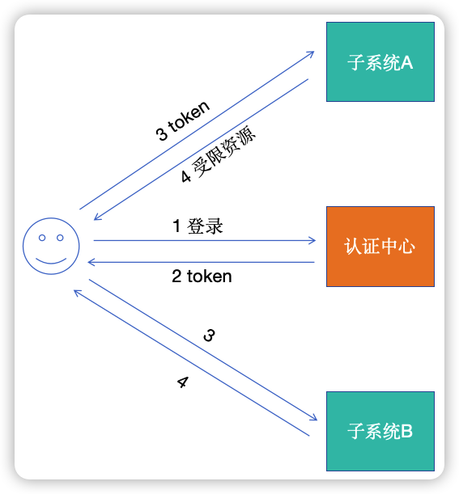
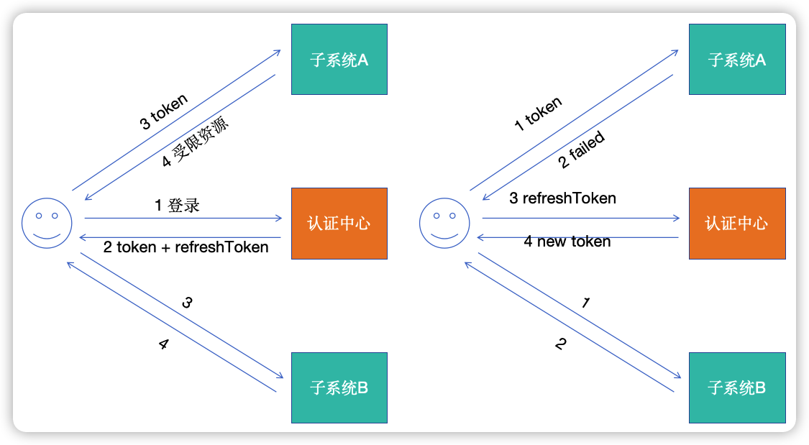

---

title: 单点登录
date: 2024-02-25T14:15:00
authors:
  name: GSemir
  url: https://github.com/GSemir0418
  image_url: https://github.com/GSemir0418.png
  email: gsemir0418@gmail.com
tags: [sso, refreshToken]
---

> session-cookie模式：认证中心既要登录又要鉴权，虽然实现对用户的绝对掌控，但压力过大
>
> token 模式：认证中心只需登录，签发 token，鉴权就交给子服务，减轻压力。但是认证中心失去了对用户的绝对控制
>
> 既希望对用户的绝对控制，又不想给认证中心太大压力，推出了双  token 模式。第一个 token 过期时间很短，第二个 refreshToken 过期时间较长，第一个过期了就去认证中心用 refreshToken 换新的。 让用户每隔一小段时间来一次认证中心，从而保持认证中心对用户绝对的控制

## 需求

某公司有很多子产品线，为了提升用户体验，希望用户只要在其中一个系统登录，再访问另一个网站就会自动登录

## Session-cookie

一种实现方案基于 session-cookie，将用户管理的业务单独抽离出来，成为独立的用户认证中心，用来鉴权与管理用户信息。

```
1. 用户向认证中心发起登录请求，登录成功后，认证中心会生成 session_id，结合用户信息，以 key value 的形式储存到服务器的数据库/内存中
2. 将 session_id 通过 Set-cookie 方法发送给客户端
3. 当用户再次向子系统发起请求时，浏览器会自动带上这个 id 作为 cookie 请求头，供服务端验证
4. 此时子系统会访问认证中心的服务器，认证中心来验证用户的登录状态
5. 如果服务端的 session 数据中有这条数据，说明用户的登录验证是有效的；反之说明用户没有登录或登录过期
```



这种方式的**优势**在于

- 架构清晰

- 认证中心对于用户的管理具有很强的控制力

**缺点**也显而易见——烧钱

- 对于用户量较大的应用，同时在线人数很多，无论是认证中心的请求响应业务还是数据存储的压力都非常大，所以对服务器的配置要求也非常高；

- 而且如果认证中心服务挂了，所有系统都瘫痪了，所以还需要做容灾；

- 还有就是只要某个子系统有扩容需求时，认证中心的服务为了满足这个子系统的需求也要跟着扩容

## Token

为了降低认证中心的压力，降低成本，提出了 Token 模式

即认证中心服务器索性不保存 session 数据了，所有数据都保存在客户端，每次请求都发回服务器。JWT 就是这种方案的一个代表。

```
1. 用户向认证中心发起登录请求，登录成功后，认证中心会加密生成一个不会被篡改的字符串（Token），发送给客户端
2. 客户端本地保存 localStorage/cookie，接下来认证中心就什么都不管了
3. 当用户再次向子系统请求受限的资源时，将这个 token 也带过去，由子系统自行验证即可（与认证中心共享加密密钥）
4. 子系统无需频繁向认证中心验证用户登录状态，
```



**优点**在于显著降低了成本低了，也解除了与子系统的依赖

缺点在于**认证中心失去了对用户绝对的控制**

## 双 token

为了弥补这个缺陷，在 token 方案的基础上，提出了双 token 的模式，

即在普通 token 的基础上，增加一个 refreshToken

```
1. 用户向认证中心发起登录请求，登录成功后，认证中心会加密生成两个 Token，发送给客户端
2. 一个是可以供子系统自行认证的 token，另一个是只有认证中心才能解密的 token
3. 但是第一个 token 过期时间通常设置的短一些（10 min），第二个 refresh Token 的过期时间要久一些（一个月）
4. 当第一个 token 过期时，用户就会使用 refreshToken 请求认证中心，认证中心校验成功后，颁发新的 token
```



这样的目的就是让用户**每隔一小段时间来一次**认证中心，从而保持认证中心对用户绝对的控制

## 如何实现 Token 的无感刷新？

> Token 无感刷新就是上面说的**双 token** 的具体实现方案，只有在**单点登录**的场景下才可以讨论

主体逻辑并不难，难在处理刷新时机与冗余刷新等一些细节问题

利用响应拦截器来完成主体逻辑

如果响应中含有 token 或者 refreshToken，则存储到本地

如果响应表示无权限

request.js

```js
import axios from 'axios'
import { setToken, setRefreshToken, getToken } from './token'
import { refreshToken, isRefreshRequest } from './refreshToken'

const ins = axios.create({
  baseURL: 'xxxx',
  headers: {
    Authorization: `Bearer ${getToken()}`
  }
})

ins.interceptors.response.use(async (res) => {
  // 如果有短 token，就保存/更新 ls
	if (res.headers.authorization) {
    const token = res.headers.authorization.replace('Bearer ', '')
    setToken(token)
    // 修改默认请求头为最新的 token
    ins.defaults.headers.Authorization = `Bearer ${token}`
  }
  
  // 如果有 refreshtoken，就保存/更新 ls
  if (res.headers.refreshtoken) {
    const refreshToken = res.headers.refreshtoken.replace('Bearer ', '')
    setRefreshToken(refreshToken)
  }
  
  // 如果响应无权限且不是刷新 token 的请求，就调用更新 token 的接口，并重新发起请求
  if (res.data.code === 401 && !isRefreshRequest(res.config)) {
    // 刷新 token
    const isSuccess = await refreshToken()
    if (isSuccess) {
      // 如果成功换到了新 token 
      // 使用之前请求的配置（修改权限请求头）重新发起请求
    	res.config.headers.Authorization = `Bearer ${getToken()}`
    	const resp = await ins.request(res.config)
    	return resp
    } else {
      console.log('请重新登录')
    }
    
  }
  
  return res.data
})

export default ins
```

refreshToken.js

```js
import request from './request'
import { getRefreshToken } from './token'

// 缓存刷新 token 请求的 promise
let promise

export async function refreshToken() {
  if (promise){
    return promise
  }
  
  promise = new Promise((resolve) => {
    const res = await request.get('/refresh-token', {
      headers: {
        Authorization: `Bearer ${getRefreshToken()}`,
      },
      // 标记是否是刷新 token 的请求
      __isRefreshToken: true
    })
    resolve(res.code === 0)
  })
  
  promise.finally(() => promise = null)
  
  return promise
}

export function isRefreshRequest(config) {
	return !!config.__isRefreshToken
}
```

为了解决刷新 token 期间产生的新请求，仍然会重复请求刷新 token 的问题

我们可以将 refreshToken 的结果缓存为一个变量 promise，如果这个 promise 没结束，说明还没完成刷新 token 的请求

这样一来，在刷新 token 期间产生的请求，都等待（await）的是同一个刷新 token 的 promise，解决了冗余请求刷新 token 的问题
