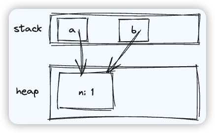
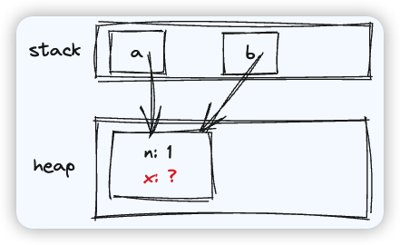
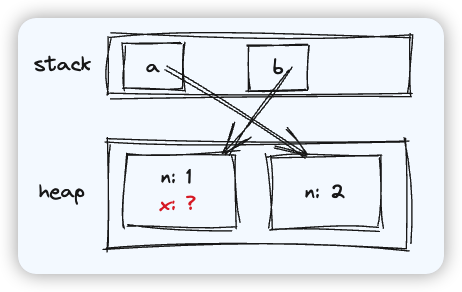
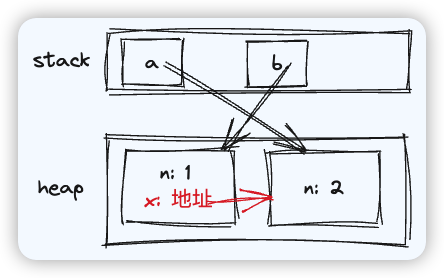

面试题：

```js
var a = { n: 1 }
var b = a
a.x = a = { n: 2 }
console.log(a.x)
console.log(b.x)
```

前两行代码很容易理解，下面是其内存示意图：



赋值运算，我们常规的分析思路是先处理右边的，在把计算结果给左边即可

但实际上，是**先要根据左边定位其内存空间，再把右边的返回值赋值给左边**

第三行代码相当于，将表达式 `a = { n: 2 }` 的返回值，赋值给 `a.x`

定位：先确定 `a.x` 的内存空间，在堆上开辟一个属性 x，但属性值未知



然后处理右边表达式  `a = { n: 2 }` 

先定位 a 的内存空间，在堆上开辟一块内存空间 `{ n: 2 }`，然后修改 a 的指向为新对象



该表达式的返回值就是 a 变量此时指向的**新地址**，因此 x 属性的值也被确定了



显而易见，此时 `a.x` 为 `undefined`，`b.x` 为 `{ n: 2 }`