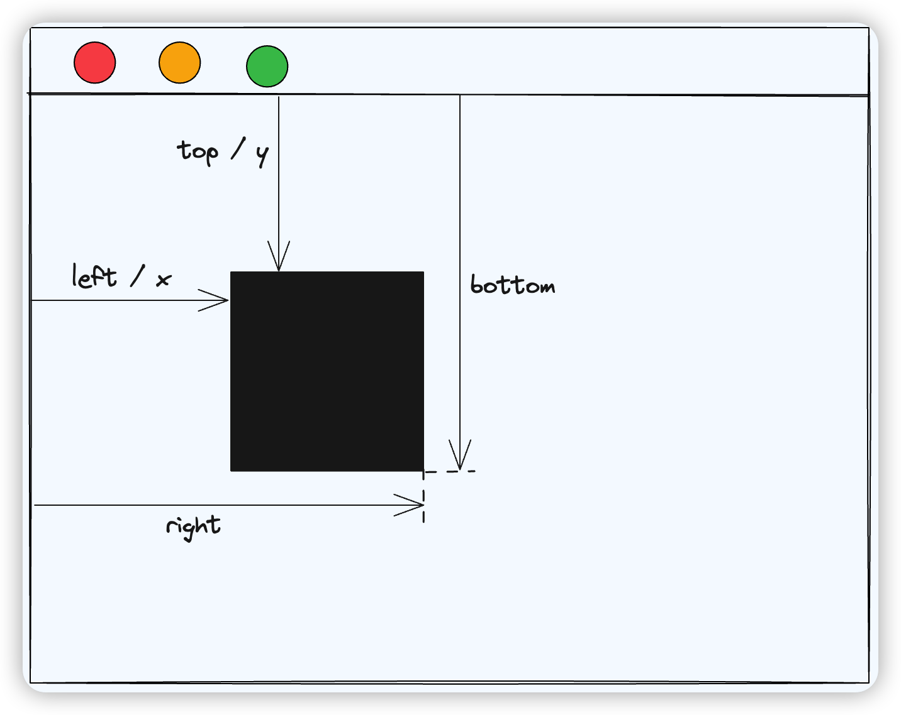
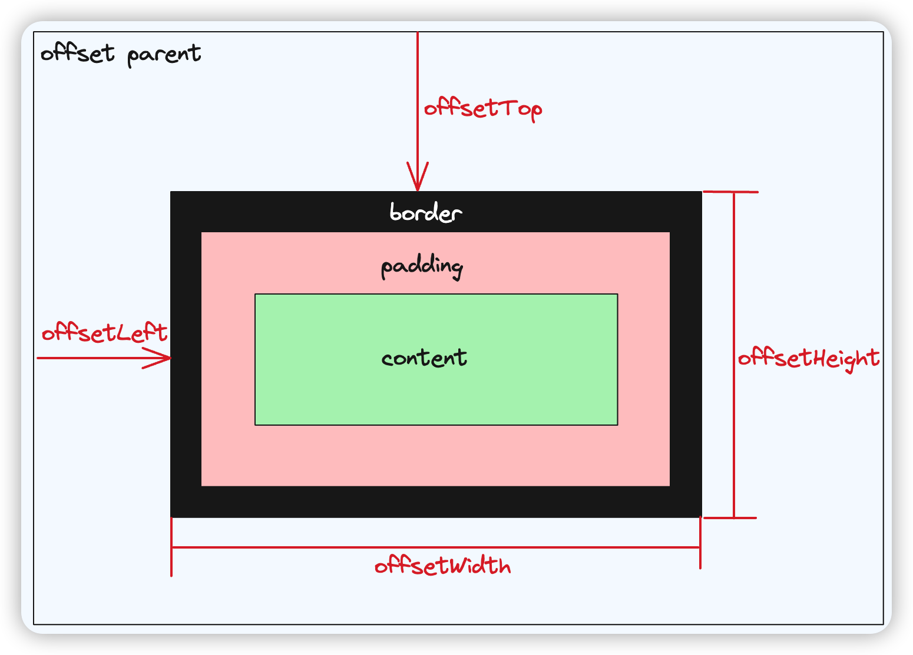
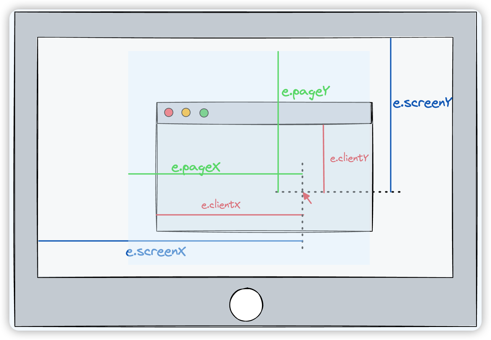
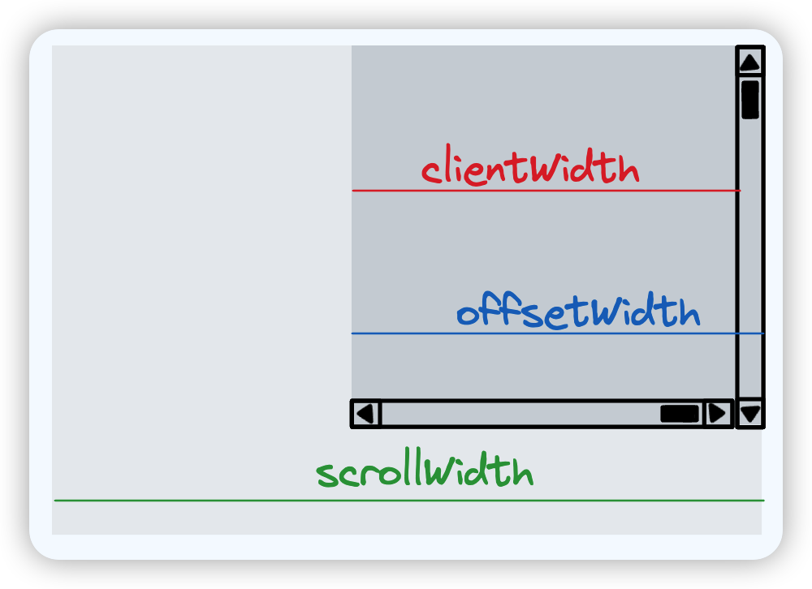
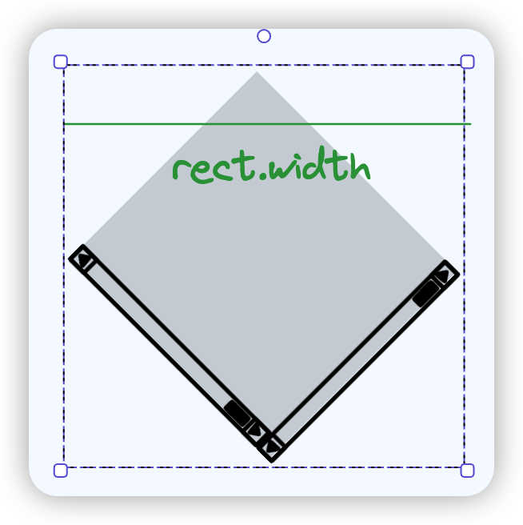

### 元素/鼠标的位置

#### getBoundingClientRect() 

获取包含整个元素的最小矩形（包括 `padding` 和 `border-width`），相对视口左上角，使用`x`、`y`、`top`、`left`、`bottom`、`right`等属性描述整个矩形的位置



```js
const element = document.getElementById("myElement");
const rect = element.getBoundingClientRect();
console.log("元素左上角的X坐标：" + rect.left);
console.log("元素左上角的Y坐标：" + rect.top);
console.log("元素右下角的X坐标：" + rect.right);
console.log("元素右下角的Y坐标：" + rect.bottom);
```

#### offsetTop 和 offsetLeft 属性： 

相对父元素的偏移量



```js
const element = document.getElementById("myElement");
console.log("元素的上边缘的偏移量：" + element.offsetTop);
console.log("元素的左边缘的偏移量：" + element.offsetLeft);
```

#### pageX 和 pageY 属性： 

> `screen >= page >= client`

`pageX/Y`获取到的是鼠标相对**文档区域**左上角距离，会随着页面滚动而改变

```js
element.addEventListener("mousemove", function(event) {
  console.log("鼠标的X坐标：" + event.pageX);
  console.log("鼠标的Y坐标：" + event.pageY);
});
```

#### clientX 和 clientY 属性：

`clientX/Y`获取到的是鼠标相对**浏览器可视区域**左上角距离，不随页面滚动而改变

```js
element.addEventListener("mousemove", function(event) {
  console.log("鼠标在视口中的X坐标：" + event.clientX);
  console.log("鼠标在视口中的Y坐标：" + event.clientY);
});
```

#### screenX 和 screenY 属性：

`screenX/Y`获取到的是鼠标相对**显示器屏幕**左上角的距离，不随页面滚动而改变。



### 元素的尺寸

#### 不可靠的方式

`window.getComputedStyle(dom).width`

获取 CSSOM 树（浏览器渲染第二步）的节点尺寸

不一定能反应界面上的最终实际尺寸（padding，border，flex）

`dom.style.width`

获取 dom 元素（DOM 树）上的 style 属性，即内联样式，同样不一定能反应界面上的实际尺寸（还可能读不到）


以下三种方式读到的是 Layout 树的信息，可以读到元素的**几何信息**（不考虑 transform）

#### dom.clientWidth

content + padding

#### dom.offsetWidth

content + padding + scroll + border

clientWidth + scroll + border

#### dom.scrollWidth

可滚动区域的全部尺寸



#### getBoundingClientRect()

读取到的是在浏览器渲染管线最后一步 draw 后的尺寸数据，也就是我们能看到的元素的**实际最终尺寸**

> draw 阶段会处理一些 transform 变换，本质上是矩阵变换，由 GPU 计算并绘制到屏幕中，效率非常高

