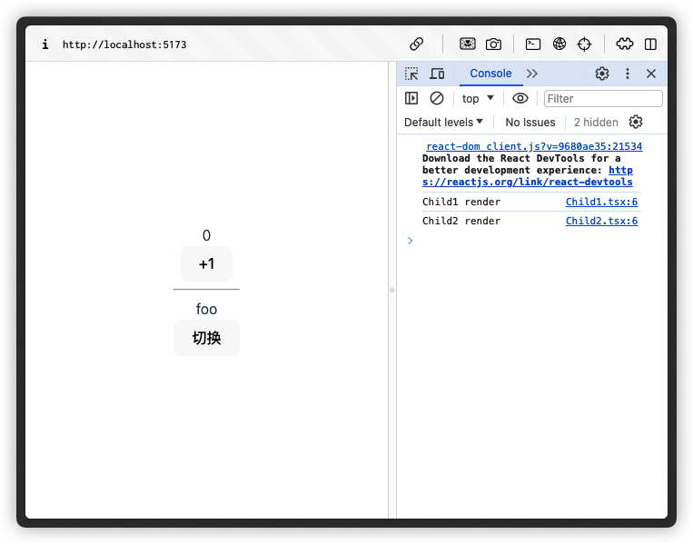
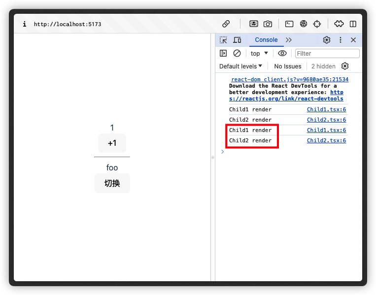

> Zustand: https://github.com/pmndrs/zustand

## Why Zustand

Zustand 是一个小型、快速且可扩展性强的，基于 hooks 的状态管理库

**简单**：原理、源码、思想、用法

> Zustand 团队同时也开发了 [Jotai](https://jotai.org/)、[Valtio](https://valtio.pmnd.rs/docs/introduction/getting-started) 状态管理库
>
> - Zustand 基于发布订阅模式
> - Valtio 基于 Proxy（类似 Vue3）
> - Jotai 基于『原子化』状态的概念


## 核心原理

> Zustand = 发布订阅 + useSyncExternalStore

基于发布订阅模式实现了基本数据维护与通知更新，与框架的集成则基于 React 官方提供的 `useSyncExternalStore` 来实现，订阅外部store，实现状态更新后，触发组件重新渲染

> 出于兼容性考虑以及 selector 实现，Zustand 并未直接使用 react 库提供的 useSyncExternalStore hook，而是使用了 use-sync-external-store 库提供的 useSyncExternalStoreWithSelector()

## 基本使用

```typescript
// 定义
import { create } from 'zustand'

interface CountStore {
  count: number
  add: () => void
}

export const useCountStore = create<Store>((set, get) => ({
  count: 0,
  add: () => set((state) => ({ count: state.count + 1  })), // ✅
  // add: () => set({ count: get().count + 1}), // ❌
  // 出于可维护性和并发安全性考虑，应该使用上面的方式获取最新的 count
  // 但没有测试出来异步并发情况下的 bug，不过官方推荐了第一种方式
}))

// 使用
import { useCountStore } from 'xxx'
const { count, add } = useCountStore()
```

## 中间件

```ts
export const useCountStore = create<Store>(
  redux(persist(
      (set, get) => ({
        count: 0,
        add: () => set((state) => state.count + 1),
        // add: () => set({ count: get().count + 1}),
      })
  	)
  )
)
```

## 注意事项

当我们需要在两个组件使用同一个仓库的不同状态时：

```tsx
// App.tsx
function App() {
  return (
    <>
      <Child1 />
      <hr/>
      <Child2 />
    </>
  )
}

// Child1.tsx
export const Child1 = () => {
  const { count, addCount } = useConfigStore()

  console.log('Child1 render')
  
  return (
    <>
      <div>{count}</div>
      <button onClick={addCount}>+1</button>
    </>
  )
}

// Child2.tsx
export const Child2 = () => {
  const { name, setName } = useConfigStore()

  console.log('Child2 render...')

  return (
    <>
      <div>{name}</div>
      <button onClick={() => setName(name === 'bar' ? 'foo' : 'bar')}>切换</button>
    </>
  )
}

// Store
interface ConfigStore {
  count: number
  name: string
  addCount: () => void
  setName: (name: string) => void
}

export const useConfigStore = create<ConfigStore>((set) => ({
  count: 0,
  name: 'foo',
  addCount: () => set((store) => ({ count: store.count + 1 })),
  setName: (name) => set({ name }),
}))
```

页面初始渲染时，此时两个子组件分别被渲染一次



当我们点击「+1」按钮时，改变了 count 状态，因此 Child1 组件重新渲染了。但是我们发现此时 Child2 也跟着重新渲染了：



Child2 作为 Child1 的兄弟组件，二者也并没有交叉的状态值，可以说两个组件是完全独立的。

### 解决方案

当我们调用 `addCount` 或者 `setName` 函数时，它们会通过 `set` 函数更新 Zustand 状态，并通知所有订阅了这个 store 的组件去重新渲染。

由于 `Child1` 和 `Child2` 组件都从同一个 `useConfigStore` 钩子中获取状态，它们实际上都订阅了整个状态对象，这意味着无论哪一个状态更新，两个组件都会重新渲染，即使它们各自只用到了其中的一个状态。

这是因为 Zustand 的状态更新机制是基于「浅比较」的，更新状态时会**替换整个**状态对象，导致所有使用状态的组件认为状态已经变化，即使它们依赖的那部分状态实际上并没有变。

为了解决这个问题，我们可以利用 Zustand 提供的选择器功能。选择器允许组件只订阅状态对象中的一部分，从而当全局状态对象发生变化时，只有当组件所依赖的那部分状态实际发生变化时，组件才会重新渲染。

通过使用选择器，我们实际上创造了状态的快照，并使组件只关注快照中的那部分。当状态更新时，只有快照发生变化的组件会被通知更新。

为了防止不必要的渲染，你需要确保 `Child1` 组件仅订阅 `count` 状态，`Child` 组件仅订阅 `name` 状态。当各自相关的状态改变时，对应的组件才会重新渲染，而不会影响到另外一个。这种方式不仅可以提高性能，还可以避免不必要的渲染带来的问题，如界面闪烁或是计算量的不必要增加

```diff
// Child1.tsx
- const { count, addCount } = useConfigStore()
+ const count = useConfigStore((state) => state.count)
+ const addCount = useConfigStore((state) => state.addCount)
```

但这样在状态非常复杂的时候会造成代码冗余，下面提出解决方案

#### 优化1

创建自定义的 Hooks 来获取特定的状态和状态更新函数，封装选择器的使用

```ts
export const useCount = () => {
  const count = useConfigStore((state) => state.count)
  const addCount = useConfigStore((state) => state.addCount)
  return { count, addCount }
}
```

#### 优化2

状态仓库拆分，每个 Store 管理的状态的功能尽可能单一

## 源码阅读

首先从 index 入手

```typescript
// src/index.ts
// 将 vanilla.ts 和 react.ts 中定义的所有内容（除默认导出外）在当前文件中重新导出，方便其他模块统一导入。
export * from './vanilla.ts'
export * from './react.ts'
// 直接导出了 react.ts 的默认导出项作为这个模块的默认导出项
export { default } from './react.ts'
```

react.ts 中依赖了 vanilla.ts，所以我们先看下 vanilla.ts 文件

### Vanilla

#### createStore

该文件导出了 `createStore` 高阶函数，返回值取决于是否传递了 `createState` 参数。该函数用于灵活地创建 store 实例，返回 store api

```typescript
export const createStore = ((createState) =>
  createState ? createStoreImpl(createState) : createStoreImpl) as CreateStore
```

在其类型声明中，涉及到了*函数重载*

```typescript
type CreateStore = {
  <T, Mos extends [StoreMutatorIdentifier, unknown][] = []>(
    initializer: StateCreator<T, [], Mos>,
  ): Mutate<StoreApi<T>, Mos>

  <T>(): <Mos extends [StoreMutatorIdentifier, unknown][] = []>(
    initializer: StateCreator<T, [], Mos>,
  ) => Mutate<StoreApi<T>, Mos>
}
```

这两部分代码可能看起来有些复杂。这是因为 Zustand 支持使用 mutator 来修改 state，而 mutator 本身可以被定义为一个包含多个元素的数组，每个元素都是一个 `[StoreMutatorIdentifier, unknown]` 类型的数组。

为了方便理解，我们将涉及到中间件的类型暂时移除

```typescript
type CreateStore = {
  <T>(initializer: StateCreator<T>): StoreApi<T>
  <T>(): (initializer: StateCreator<T>) => StoreApi<T>
}
```
- 第一种形式表示 createStore 可以是一个函数，接收 initializer 作为参数，返回 StoreApi；

- 第二种形式表示 createStore 是一个柯里化函数，接收一个无参的函数，返回另外一个接收 initializer 作为参数、返回 StoreApi 的函数

使用示例

```ts
const initializer = (set, get, api) => ({})
// 直接创建 store                                         
const store = create(initializer)
// 先得到创建 store 的方法
const createStore = create()
const store = createStore(initializer)
```

#### StateCreator

我们继续看下 `initializer` 也就是 `StateCreator` 的类型定义

```typescript
export type StateCreator<
  T,
  Mis extends [StoreMutatorIdentifier, unknown][] = [],
  Mos extends [StoreMutatorIdentifier, unknown][] = [],
  U = T,
> = ((
  setState: Get<Mutate<StoreApi<T>, Mis>, 'setState', never>,
  getState: Get<Mutate<StoreApi<T>, Mis>, 'getState', never>,
  store: Mutate<StoreApi<T>, Mis>,
) => U) & { $$storeMutators?: Mos }
```

同样暂时将中间件相关的类型定义移除

```typescript
export type StateCreator<T> = (
  setState: Get<StoreApi<T>, 'setState', never>,
  getState: Get<StoreApi<T>, 'getState', never>,
  store: StoreApi<T>,
) => T
```
StateCreator 是一个用户自定义的函数，用于初始化 store 的状态。它接受三个参数：`setState`、`getState` 和 `api`。

- `setState` 是一个函数，用于更新 store 的状态。
- `getState` 是一个函数，用于获取当前的 store 状态。
- `api` 是包含 store 所有公开方法的对象。

其中 `Get` 类型表示 K 如果在 T 对象的 keys 中，则返回 K 属性对应的值的类型，否则返回 F

```typescript
type Get<T, K, F> = K extends keyof T ? T[K] : F
```

使用示例：

```js
const store = create((set, get, api) => ({}))
```

#### StoreApi

回到 createStore 的类型定义，继续看返回值 `StoreApi` 类型定义

```typescript
export interface StoreApi<T> {
  setState: SetStateInternal<T>
  getState: () => T
  getInitialState: () => T
  subscribe: (listener: (state: T, prevState: T) => void) => () => void
  /**
   * @deprecated Use `unsubscribe` returned by `subscribe`
   */
  destroy: () => void
}
```

返回了五个 api（destory 即将废弃），其中 `SetStateInternal` 的定义如下

```typescript
type SetStateInternal<T> = {
  _(
    partial: T | Partial<T> | { _(state: T): T | Partial<T> }['_'],
    replace?: boolean | undefined,
  ): void
}['_']
```

为什么额外使用了一个对象字面量 `_` 和查找类型的，看似多此一举的操作?

我们先来对比下二者的区别

```typescript
type SetStateInternal<T> = {
  _(
    partial: T | Partial<T> | { _(state: T): T | Partial<T> }['_'],
    replace?: boolean | undefined,
  ): void
}['_']

type SetStateInternal2<T> = (
  partial: T | Partial<T> | ((state: T) => T | Partial<T>),
  replace?: boolean | undefined
) => void

type State = { name: string; age: number }

// 此时 setState 的类型定义为 const setState: (partial: ..., replace?: ...) => void
declare const setState: SetStateInternal<State>
// 而 setState2 的类型定义为 const setState2: SetStateInternal2<State>
declare const setState2: SetStateInternal2<State>
```

SetStateInternal 与 SetStateInternal2 的类型是一致的，但是当作为变量的类型时，该变量的编辑器提示出现了如上的差异，即使用了这个技巧的变量，其提示更具体；

```typescript
type T1 = {
  name: string,
  age: number
}

type T0 = {
  _:{name: string, age: number}
}['_']

const t1: T1 = { name: "", age: 0 }
const t0: T0 = { name: "", age: 0 }
```

- 其中一种可能是，声明并读取 `_` 属性的原因之一是为了使函数类型获得更清晰的类型支持，帮助开发者更容易理解和使用 API

#### createStoreImpl

vanilla 中的类型定义就先告一段落，下面我们学习创建 store 实例的核心逻辑实现： `createStoreImpl`，详见注释

```typescript
const createStoreImpl: CreateStoreImpl = (createState) => {
  type TState = ReturnType<typeof createState>
  type Listener = (state: TState, prevState: TState) => void
  // 初始状态，类型为 createState 方法的返回值类型
  let state: TState
  // 使用集合存储订阅者
  const listeners: Set<Listener> = new Set()

  // partial: 接收一个新的状态对象 | 部分状态对象 | 接收当前状态并返回更新后状态或部分对象的函数
  // replace：决定是状态直接替换还是合并
  const setState: StoreApi<TState>['setState'] = (partial, replace) => {
    // 根据参数类型，计算 nextState
    const nextState =
      typeof partial === 'function'
        ? (partial as (state: TState) => TState)(state)
        : partial
    // 使用 Object.is 浅对比前后 state
    if (!Object.is(nextState, state)) {
      const previousState = state
      // 如果替换，直接赋值 state 为 nextState
      // 如果不替换，且 nextState 是对象，则合并前后状态
      state =
        replace ?? (typeof nextState !== 'object' || nextState === null)
          ? (nextState as TState)
          : Object.assign({}, state, nextState)
      // 通知状态更新
      listeners.forEach((listener) => listener(state, previousState))
    }
  }

  const getState: StoreApi<TState>['getState'] = () => state

  const getInitialState: StoreApi<TState>['getInitialState'] = () =>
    initialState

  // 新增订阅者，返回取消订阅的方法
  const subscribe: StoreApi<TState>['subscribe'] = (listener) => {
    listeners.add(listener)
    return () => listeners.delete(listener)
  }

  const destroy: StoreApi<TState>['destroy'] = () => {
    // 废弃警告
    listeners.clear()
  }

  const api = { setState, getState, getInitialState, subscribe, destroy }
  // 赋值 initialState 与 state
  const initialState = (state = createState(setState, getState, api))
  return api as any
}
```

### React

同样，我们先从 create 函数入手。create 函数与 vanilla 中逻辑一致，根据传入参数，返回 `createImpl` 函数或者调用该函数。

#### createImpl

`createImpl` 函数是 `create` 函数的具体实现。它内部检查 `createState` 的类型，确保其为函数，并最终调用 `createStore`（来自 `./vanilla.ts` 文件）来创建一个 store。

createImpl 返回一个 `useBoundStore` 方法，它是由 createStore 和 useStore 的返回值组装的，分别对应着 api 和 useBoundStore，api 这个对象存放着一系列的方法比如 setState、getState 等

```ts
const createImpl = <T>(createState: StateCreator<T, [], []>) => {
  // 开发环境警告
  if (
    import.meta.env?.MODE !== 'production' &&
    typeof createState !== 'function'
  ) {
    console.warn(
      "[DEPRECATED] Passing a vanilla store will be unsupported in a future version. Instead use `import { useStore } from 'zustand'`.",
    )
  }
  // 调用 vanilla 的 createStore 函数，获取该函数返回的 api 对象
  const api =
    typeof createState === 'function' ? createStore(createState) : createState

  const useBoundStore: any = (selector?: any, equalityFn?: any) =>
    useStore(api, selector, equalityFn)

 
  Object.assign(useBoundStore, api)

  // 返回 useBoundStore 函数
  return useBoundStore
}
```

下面对于其中的 `useBoundStore`、`useStore` 进行分析

#### useStore

`useStore` 内部利用 `use-sync-external-store/shim/with-selector` 包中的  `useSyncExternalStoreWithSelector` 实现对状态的订阅和更新。这保证了状态变更能够即时反映到组件上

```ts
import useSyncExternalStoreExports from 'use-sync-external-store/shim/with-selector'
const { useSyncExternalStoreWithSelector } = useSyncExternalStoreExports;

const identity = arg => arg;

export function useStore<TState, StateSlice>(
  api: WithReact<StoreApi<TState>>,
  selector: (state: TState) => StateSlice = identity as any,
  equalityFn?: (a: StateSlice, b: StateSlice) => boolean,
) {
  // 开发环境警告
  if (
    import.meta.env?.MODE !== 'production' &&
    equalityFn &&
    !didWarnAboutEqualityFn
  ) {
    console.warn(
      "[DEPRECATED] Use `createWithEqualityFn` instead of `create` or use `useStoreWithEqualityFn` instead of `useStore`. They can be imported from 'zustand/traditional'. https://github.com/pmndrs/zustand/discussions/1937",
    )
    didWarnAboutEqualityFn = true
  }

  const slice = useSyncExternalStoreWithSelector(
    api.subscribe,
    api.getState,
    api.getServerState || api.getInitialState,
    selector,
    equalityFn,
  )
  // 使用 `useDebugValue` 为 React DevTools 显示调试值。
  useDebugValue(slice)
  return slice
}
```

其中`useSyncExternalStoreWithSelector`就是对 `useSyncExternalStore`的一个包装，是在`useSyncExternalStore`的基础上添加了两个参数：

- `selector`：一个函数，用于获取 `state` 中的部分数据，有了这个参数 `useSyncExternalStoreWithSelector`的返回值就可以根据`selector`的结果来返回而不是每次都返回整个 store，相对灵活方便

> 同时也解决了上面遇到的组件重新渲染的问题

- `equalityFn`：数据比较方法，如果不希望使用 `Object.is`做数据对比，可以提供自己的对比函数

#### useBoundStore

`useBoundStore` 是一个函数，基于上面对于 useStore 的分析，它调用之后会根据传入的 `selector`返回对应的 store 数据，如果没有传入`selector`，则会默认返回整个 store

这也是我们在使用 useXXXStore hook 时支持传入选择器的原理

```ts
const count = useCountStore(state => state.count)
```

`createImpl` 函数在最后将`useBoundStore`函数和`api`进行合并，目的就是方便用户在 React 组件之外修改和获取数据

```ts
useXXXStore.setState(state => ({ count: state.count + 1 }))
useXXXStore.getState()
```

#### useSyncExternalStore

最后重点讨论下 zustand 与 React 框架集成的核心 hook

`useSyncExternalStore` 是 React 18 引入的一个新 Hook，允许开发者在 React 中同步外部的数据源

**背景**：

在 React 中，我们所说的状态通常分为三种：

- 组件内部的 State/Props
- 上下文Context
- 组件外部的独立状态 Store(Redux/Zustand)

前两种状态实际上都是React内部维护的Api，自然也会跟随着React版本的迭代而进行相对应的优化。 但是组件外部的状态，对于React来说并不可控，如果需要更好的契合React本身，我们需要去写一些与本身业务逻辑无关的胶水代码。例如订阅外部状态、外部状态更新时，对组件进行重渲染。

但是在 React18 推出 Concurrent Mode 后，这种外部状态的订阅模式会存在一个问题，也就是被称为撕裂问题的 Bug。

> 假设我们的现在的页面触发了更新，需要进行 re-render，而根据 Concurrent Mode 的规则，我们会把更新过程中需要执行的任务划分优先级，优先级低的有可能会被打断。假设某个任务 A 和 B，都同时依赖了外部状态中的某个 State，在 re-render 开始时，值为1，任务 A 执行完之后，React 把线程的处理权交还给了浏览器，浏览器的某些操作导致了这个 State 的值变成了 2。那么等到 B 任务重新恢复执行时，读到的值就会出现差异，导致渲染结果的不一致性

针对上述的一些外部状态与 React 本身不契合的情况，React提供了一个名为`useSyncExternalStore`的Hook，这个hook可以让我们更加方便的去订阅外部的Store，并且避免发生撕裂问题

**使用方法**：

`useSyncExternalStore(subscribe, getSnapshot)`

**参数**：

- `subscribe`：一个函数，接收一个单独的 `callback` 参数并把它订阅到 store 上。当 store 发生改变，它应当调用被提供的 `callback`。这会导致组件重新渲染。subscribe 函数会返回清除订阅的函数。

  > Store 对象中维护的 `listener` 包含了触发 React 重新渲染的函数以及我们自己定义的监听数据变化后做的副作用函数

- `getSnapshot`：一个函数，返回组件需要的 store 中的数据快照。在 store 不变的情况下，重复调用 `getSnapshot` 必须返回同一个值。如果 store 改变，并且返回值也不同了（用 `Object.is` 比较），React 就会重新渲染组件。

**返回值**：该 store 的当前快照，可以在你的渲染逻辑中使用

**使用示例**

使用该 hook，简单模拟 zustand 与 react 的集成过程

声明 store

```ts
const createStore = () => {
  let currentListeners: any[] = []
  let currentState = { count: 0 }

  return {
    subscribe(listener: any) {
      currentListeners.push(listener)
      return () => {
        currentListeners = currentListeners.filter(l => l !== listener)
      }
    },
    getState() {
      return currentState
    },
    setState(newState: any) {
      currentState = newState;
      currentListeners.forEach(listener => listener())
    },
  }
}

export const store = createStore()
```

封装 useStore hook

```ts
import { useSyncExternalStore } from "react"
import { store } from "./store"

export const useStore = () => {
  const getSnapshot = () => store.getState()

  // useSyncExternalStore 会通过 onStoreChange 参数
  // 将组件重新渲染的逻辑注入 subscribe 中
  const subscribe = (onStoreChange: any) => {
    return store.subscribe(onStoreChange)
  }

  // 将 store 的 suscribe 与 getState 包装一下传入 hook 中
  const state = useSyncExternalStore(subscribe, getSnapshot)
  return state;
}
```

组件使用

```tsx
import { store } from "./store"
import { useStore } from "./useStore"

export const Counter = () => {
  const { count } = useStore()

  return (
    <div>
      <span>Count: {count}</span>
      <button onClick={() => store.setState({ count: count + 1 })}>Increment</button>
    </div>
  )
}
```

中间件

useSyncExternalStore hook
