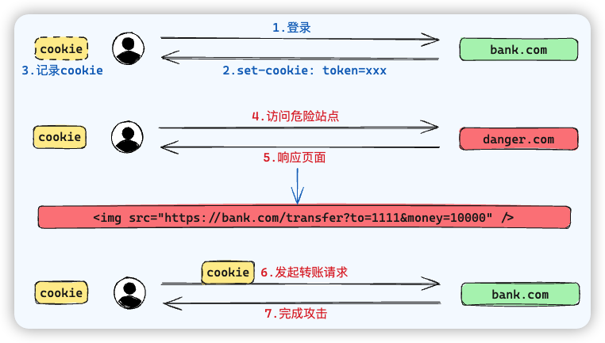

### CSRF

**Cross-Site Request Forgery  跨站请求伪造**

它是指攻击者利用了用户的身份信息，执行了用户非本意的操作

1. 首先用户正常登录银行网站，登录成功后获取 `bank.com` 的 cookie
2. 然后引导用户访问了危险网站，这个网站会响应一个**页面**，这个页面会发送请求到被攻击的站点 `bank.com`
   - 比如放一个隐藏的 `img` 标签，src 就是 bank.com 的转账接口，路径带有转账接口的参数
   - 再比如放一个 `iframe`，构造一个 post 请求的表单页面嵌入 iframe，表单会调用 bank.com 的转账接口
3. 由于浏览器在解析 HTML 时处**自动触发静态资源的请求**，于是在解析到这个静态资源时就会给 bank.com 发起转账请求，**并附带上**之前登录成功获取的 cookie，从而使接口调用成功，完成攻击

#### 防御方式

1. 不用 `cookie`，用 `jwt`，在 `ls` 中读写
2. 使用 `sameSite`，有 `none`、`strict` 和 `lax` 三种值
   1. none 为默认值，表示没有任何限制
   2. strict 表示只能是在访问同一站点时的请求才会带 cookie
   3. lax 表示宽松的，get 请求自动带上 cookie，post 请求则不会自动带 cookie
3. 使用 `csrf token`，在转账前设置**校验**环节，此时给客户端一个一次性的，用于接下来正式转账接口的 token，结合 cookie 鉴权流程，完成防御

### XSS

**Cross Site Scripting 跨站脚本攻击**

攻击者利用站点的漏洞，在表单提交时，在表单**内容**中加入一些恶意脚本。当其他正常用户浏览页面，脚本被**执行**，从而使得**页面遭到破坏**或者**用户信息被窃取**

常见于**论坛**、博客或者**评论区**等场景

#### 防御方式

**服务器**端对用户提交的内容进行**过滤或编码**

- 过滤：去掉一些危险标签，去掉一些危险的属性
- 编码：对危险的标签进行 HTML 实体编码，例如将 `` 编码为 `&lt;script&gt; &lt;/script&gt;`