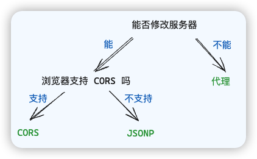

本文讨论浏览器的同源策略，跨域的常见解决方案及其原理

## 浏览器的同源策略

同源策略只存在于浏览器环境中，是浏览器的重要安全策略之一

其中，**源 = 协议 + 主机 + 端口**，两个源相同，称之为同源，反之则称为跨域或跨源

同源策略是指若**页面的源**（地址栏）和**页面运行过程中加载的源**（link、script、ajax）**不一致**时，处于安全考虑，浏览器会对跨域的资源访问进行一些**限制**

主要通过以下三种方式解决跨域的问题

- 代理
- CORS
- JSONP

无论哪种方式，都是在想办法让浏览器知道，我这次跨域的请求是自己人，就不要拦截了

对于具体方案的选择，参考下图



## 代理

代理适用的场景是：**生产环境不发生跨域**（前端服务和后端服务在一起），**但开发环境发生跨域**（前后端分离开发），主要解决前端开发环境的跨域问题

思路：将后端服务改成自己的开发服务器，这样一来浏览器就会允许这个 ajax 请求。然后开发服务器再将这个请求**转发**给后端服务器即可

即让（开发）服务器与（后端）服务器交互，从而绕开浏览器的同源限制

打包工具都自带这个功能，配置一下即可(`devServer.proxy`/`server.proxy`)

```js
// webpack
module.exports = {
  devServer: {
    port: 3000,
    proxy: {
      '/api': {
        target: 'http://localhost:8000', // 你想要代理到的目标 API 地址
        pathRewrite: {'^/api': ''}, // 可选，重写路径
        secure: false, // 如果是https接口，需要配置这个参数
        changeOrigin: true, // 如果接口跨域，需要进行这个参数配置
      }
    }
  }
};

// vite
export default defineConfig({
  server: {
    port: 3000,
    proxy: {
      // 选项写法
      '/api': {
        target: 'http://localhost:8000', // 后端服务实际地址
        changeOrigin: true, // 必须设置为true
        rewrite: (path) => path.replace(/^\/api/, '') // 重写请求路径
      },
      // 简写写法
      '/foo': 'http://localhost:4567/foo',
      // 正则表达式写法
      '^/fallback/.*': {
        target: 'http://jsonplaceholder.typicode.com',
        changeOrigin: true,
        rewrite: (path) => path.replace(/^\/fallback/, '')
      },
    }
  }
})
```

## CORS

跟前端没关系，主要是后端的处理

CORS 是基于 http 1.1 的一种跨域解决方案，它的全称是 `Cross-Origin Resource Sharing 跨域资源共享`

**如果浏览器要跨域访问服务器的资源，需要获得服务器的允许**

针对不同的请求，CORS 规定了三种不同的交互模式，分别是

- 简单请求
- 需要预检的请求
- 附带身份凭证的请求

### 简单请求

当请求**同时满足**以下条件时，浏览器会认为它是一个简单请求

- 请求方法属于 `GET`、`POST` 或 `HEAD`

- 请求头仅包含安全的字段（无自定义），例如 `Accept`、`Content-Type`、`Accept-Language` 等

- 请求头如果包含 `Content-Type`，仅限如下值之一：`text/plain`、`multipart/form-data` 或者 `application/x-www-form-urlencoded`

浏览器对于简单请求，会做如下处理

1. 给请求头自动添加 `Origin` 字段
2. 服务器响应头应包含 `Access-Control-Allow-Origin` 字段，该字段包括如下的值
   1. `*` 表示全部源都可以访问
   2. 具体的且可以访问此服务器的源

### 需要预检的请求

如果浏览器识别出该请求不属于简单请求，就会先发送 `OPTIONS` 预检请求

1. 浏览器发送预检请求，询问服务器是否允许

```http
OPTIONS /api/user HTTP/1.1
Host: crossdomian.com
...
Origin: http://my.com
Access-Control-Request-Method: POST
Access-Control-Request-Headers: a, b, content-type
```

预检请求有如下特征：

- 请求方法为 `OPTIONS`
- 没有请求体
- 请求头包含
  - `Origin`：请求的源
  - `Access-Control-Request-Method`：后续真实请求将使用的请求方法
  - `Access-Control-Request-Headers`：后续真实请求会改动的请求头

2. 服务器允许

```http
HTTP/1.1 200 OK
Access-Control-Allow-Origin: http://my.com
Access-Control-Allow-Method: POST
Access-Control-Allow-Headers: a, b, content-type
Access-Control-Max-Age: 86400
```

服务器允许的情况下，只需要在请求头中添加：

- `Access-Control-Allow-Origin`: 和简单请求一样，表示允许的源
- `Access-Control-Allow-Method`: 表示允许的后续真实的请求方法
- `Access-Control-Allow-Headers`: 表示允许改动的请求头
- `Access-Control-Max-Age`: 告诉浏览器，多少秒内，对于同样的请求源、方法、头，都不需要再发送预检请求了

后续发送真实请求的处理与简单请求相同

### 附带身份凭证的请求

默认情况下，ajax 的跨域请求并不会附带 cookie，某些需要权限的操作就无法进行

这个问题可以通过简单的配置来解决

```js
// xhr
xhr.withCredentials = true
// fetch
fetch(url, { credentials: 'include' })
```

此时，该请求就被浏览器识别为一个附带身份凭证的请求，会在预检请求头中的 `Access-Control-Request-Headers` 添加 cookie 或者 `Authorization` 字段

当服务器响应附带身份凭证的请求时，需要**明确告知**客户端，服务器允许这样的凭据

告知的方式是在预检响应头中添加 `Access-Control-Allow-Credentials: true` 即可

需要注意的是，对于这种请求，服务器**不得**设置 `Access-Control-Allow-Origin: *`

### 补充

在跨域访问时，JS 只能拿到一些最基本的响应头，例如 Cache-Control，Content-Type，Expires 等

服务器可以通过设置 `Access-Control-Expost-Headers: authorization, a, b` 响应头使 JS 能够访问这些特殊响应头

## JSONP

当需要跨域请求时，不使用AJAX，转而生成一个 `script` 元素去请求服务器，由于浏览器并不阻止 script 元素的请求，这样请求可以到达服务器

1. 本地准备好一个 `callback` 函数，相当于 ajax 的回调函数

2. 生成一个 script 标签，该 `src` 为服务器的地址

3. 服务器响应一段 js 代码，将数据作为参数传入回调中，相当于**执行**了 callback 函数

4. 相当于间接的把数据传递给客户端

JSONP 只支持 GET 请求