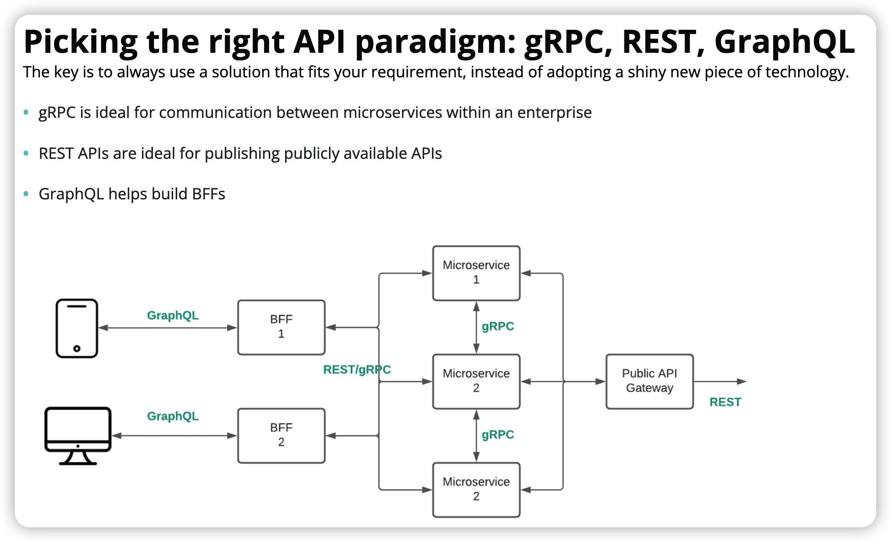
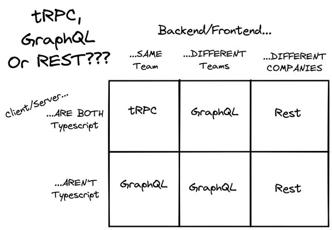

在当今的互联网时代，Web 应用程序的开发变得日益复杂和多样化。我们作为开发者，常常需要处理不同的 API 技术，以满足不同的业务需求和前端开发的要求。

在本文中，我们将深入探讨 API 技术的原理，聚焦于三种主要的 API 技术领域：`RESTful`、`GraphQL`以及`tRPC`。通过对这些API 技术的分析和比较，我们将了解它们各自的优势、适用场景以及实现原理，从而帮助开发者在选择和设计 API 时做出明智的决策。
## API 是啥

API（Application Programming Interface）即应用程序编程接口，是一种定义了不同软件组件之间**交互的规范**。它允许不同的应用程序、服务或系统之间进行**通信**和**数据交换**，使它们能够共同工作或互相**调用**功能。

## REST 架构风格

### 概述

REST 是 Representational State Transfer 的简写

- Representational：资源有某种表现形式，让资源用某种代表来展现

- State Transfer：状态传输，要求客户端的状态不保存在服务端处，每一次请求都需要正确表示自己的状态，并且传输给服务端

注意 RESTful 既不是协议，也不是语言，而是一种**惯例**或者**风格**，侧重于分配 HTTP 请求方法（GET、POST、PUT、PA TCH、DELETE）和 URL 端点之间的关系。善于运用**请求方法 + 资源**的形式来组织 API 架构

### 特点

- 客户端-服务器：REST 的客户端-服务器架构将客户端与服务器分离。该架构将客户端和服务器视为独立系统。

- 无状态通信：每个请求应该包含所有必要的信息，服务器不应保存客户端状态。

- 统一的接口：合理分配 HTTP 请求方法用于资源的操作。

- 缓存机制：利用 HTTP 的缓存机制（GET 默认缓存），减少服务端压力，提高响应速度

- 分层系统：中间系统可以存在于客户端与服务器之间。客户端和服务器都对中间系统一无所知，并像它们直接连接一样运行。

### 优势与缺点

1. 优势

接口设计非常简单和直观。看见路径就知道请求什么资源；看见动词就知道是什么操作；看见状态码就知道结果是什么

例如博客系统的增删改查接口设计（资源通常是复数形式的）：

```
GET /api/blogs/:id
DELETE /api/blogs/:id
PUT /api/blogs/:id
POST /api/blogs
```

2. 缺点

在面对实际复杂的业务中，例如获取博客中某篇博文数据与作者数据

```
方案1：
GET /api/v1/blogs/:id
GET /api/v1/authors/:id
方案2：
GET /api/v1/blog/:id 
{ id:'111', title: 'xxx', author: 'xxx', ... }
```

方案1需要发送**多次请求**；方案二我们可能会得到一些无用**冗余的字段**；同时可能在 URL 中暴露一些敏感信息，特别是在使用明文 URL 参数时，这可能导致**安全**问题

对于**复杂的关联查询场景**或者**灵活性要求很高**的情况下，RESTful 风格的 API 反而为开发者和服务器带来了一定的负担。

## GraphQL

> https://graphql.cn/learn/

### 概述

GraphQL 是一个用于 API 的**查询语言**，是一个使用基于类型系统来执行查询的**服务端运行时**（类型系统由你的数据定义）。GraphQL 并没有和任何特定数据库或者存储引擎绑定，而是依靠你现有的代码和数据支撑。

一个 GraphQL 服务是通过定义类型和类型上的字段来创建的，然后给每个类型上的每个字段提供解析函数。

> 在线体验
> 
> https://studio.apollographql.com/graph/spotify-demo-graph-fntj4/variant/main/explorer

### 核心概念

#### 类型字段定义
指定 API 的功能，并定义客户端如何请求数据
```
type Query {
  author(id: ID!): Author
}
type Author {
  name: String!
  age: Int
  posts: [Post]
}
type Post {
  title: String
  content: String
}
type Mutation {
  createAuthor(name: String!, age: Int): Author!
}
```
Query 是查询入口类型，全局唯一；类型中定义字段（Field），可接受参数，`!` 表示非空；Mutation 定义了创建作者数据的类型 


#### Query

```
query {
  author(id: "1001") {
    name
    posts {
      title
      content
    }
  }
}
```
以上查询语句表示查询 id 为 1001 的用户，获取其姓名及发布的全部文章标题和内容数据
注明操作类型（query），操作名（field），变量（id），大括号中就是服务端要响应的内容

#### Mutation
```
mutation {
  createAuthor(name: "GSemir", age: 27) {
    name
    age
  }
}
```
以上mutation语句表示创建一个作者，并返回其姓名及年龄

### 实践

> React & GraphQL Client
>
> https://www.freecodecamp.org/news/5-ways-to-fetch-data-react-graphql/
> 
> Nodejs & TS & GraphQL Server
> 
> https://www.freecodecamp.org/news/how-to-use-typescript-with-graphql/
// TODO

### 总结

- 相对于 RESTful 来说，GraphQL 的优势主要体现在查询功能上，当然 GraphQL 也提供了基本的 CRUD 功能（mutation）

- 但 GraphQL 需要单独搭建一个服务，这就使得后端开发的工作量大提升。因为 GraphQL 仅仅只是提供了统一的平台与规范，具体工作（数据库交互、Schema 定义、resolver 开发）还是需要后端开发来实现的

- 对于简单项目，可以首选 RESTful；对于存在复杂逻辑关系的数据，且有强类型的需求，或者要面对很多移动端用户，对客户端的性能有较高的要求，就要选择 GraphQL 了

## tRPC

### RPC

RPC（Remote Procedure Call）是在 1970 年代末和 1980 年代初提出的。RPC API 允许开发人员在外部服务器中调用远程函数，就好像它们在软件本地一样。

RESTful 中，我们通过访问 url 来获取响应；使用 RPC，我们通过调用函数来获取响应。
```
// HTTP/REST
const res = await fetch('/api/users/1');
const user = await res.json();
// RPC
const user = await api.users.getById({ id: 1 });
```
#### 特点


何时使用
远程过程调用（RPC）通常用于调用服务器上需要操作结果的远程函数。当您需要进行复杂计算或者想要在服务器上触发远程过程时，可以使用它，并使该进程对客户端隐藏。

使用远程设备的摄像头拍照
在服务器上使用机器学习算法识别欺诈行为
在远程银行系统上将资金从一个账户转到另一个账户
远程重启服务器

### tRPC

> https://trpc.io/

tRPC（Typed RPC）是一种类型安全的 RPC 框架，旨在提供高效、简单且易于使用的 API 解决方案。基于 Express

#### 概述

tRPC 能够让我们在无需代码自动生成器的帮助或在运行时额外检测的情况下，写出端对端类型安全的 API。它利用了 TypeScript 的强大推断功能来推断出你 API 路由的类型定义，并让你在前端能够调用 API 时充分享受完全类型安全和全自动补全的特性。

tRPC 可以被视为在前端和后端各套了一个新的服务层，用于处理接口类型和调用的逻辑。它在前端和后端之间充当了一个桥梁，负责处理远程过程调用（RPC）以及数据的类型定义。

tRPC 基于 Express 与 TypeScript，所以非常（或者仅？）适用于 TypeScript 全栈项目开发。

#### 实践

// TODO

```
顺便提一下gRPC：
gRPC和tRPC都是用于构建分布式系统的RPC框架，它们都允许在不同计算机或进程之间进行函数调用，但它们在设计理念、类型系统以及传输协议上有所不同。gRPC使用Protocol Buffers和HTTP/2作为传输协议，而tRPC使用TypeScript和HTTP/1.1作为传输协议。
```
> 推荐一个TypeScript全栈框架 T3
>
> https://create.t3.gg/zh-hans/introduction

## 总结

- RPC 侧重于**函数或操作**，而 REST 则侧重于**资源或对象**，GraphQL 更侧重于**灵活性**和**类型安全**。

以查询全部 blogs 数据为例，三者的请求方式如下
```
RESTful
GET /api/blogs

GraphQL
POST /graphql 
{
  query {
    blogs
  }
}

RPC
const user = await api.blogs.getAllBlogs();
```

### 如何选择

关于项目 API 架构风格的选择，建议如下：



