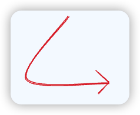

[[資料結構\] 學習筆記 — 4. Binary Search Tree 二元樹 | by Amber Fragments | Medium](https://medium.com/@amber.fragments/資料結構-學習筆記-4-binary-search-tree-二元樹-78efab024c67)

`Tree` 是一种带有 `parent / child` 关系的节点所组成的数据结构

> `List` 是线性的，`Tree` 是非线性的，但是 List 从某种程度来说可以看作是一种非常*特殊*的树状结构

### 特点

- 兄弟节点之间没有关系

- 一个 child 节点不会有两个 parent 节点

### 相关概念

Root：树最高的根节点

Child：与一个节点直接向下关联的另一个节点

Parent：一个节点直接向上关联的另一个节点

Sibling：有同一个 parent 节点的其他 nodes

Leaf：没有子节点的节点

Edge：节点与节点的连接

### 常见 Tree 应用

HTML DOM

JSON

Abstract Syntax Tree

Folders in Operation System

### Tree 的种类

`Trees`：一个节点可以拥有任意数量的子节点

`Binary Trees`：一个节点最多只能有两个子节点

`Binary Search Trees（BST）`：同样一个节点最多只能有两个子节点，并且子节点以右大左小的方式排列

本文重点介绍 BST 在 JS 中的实现

```js
class Node {
  constructor(value) {
    this.value = value
    this.left = null 
    this.right = null
  }
}

class BunarySearchTree {
  constructor() {
    this.root = null
  }
}

const bst = new BunarySearchTree()
const root = new Node(0)
const c1 = new Node(1)
const c2 = new Node(2)
const c13 = new Node(3)
const c14 = new Node(4)

root.left = c1
root.right = c2
c1.left = c13
c1.right = c14

bst.root = root
console.log(root)

// Node {
//   value: 0,
//   left: Node {
//     value: 1,
//     left: Node { value: 3, left: null, right: null },
//     right: Node { value: 4, left: null, right: null }
//   },
//   right: Node { value: 2, left: null, right: null }
// }
```

### 树的遍历

- Breadth First Search：简写 BFS ，横向的遍历，先遍历完相同阶层的 node，再往下一层开始遍历

- Depth First Search：简写 DFS，纵向的遍历，先遍历过 child nodes，再往下一个节点的所有 child nodes 遍历，以此类推
  - DFS 根据遍历顺序的不同，又可以分为三种：InOrder、preOrder、PostOrder
  - 这些遍历方法的名称是根据节点被访问的顺序来命名的。在前序遍历中，根节点是第一个被访问的；在中序遍历中，根节点是在左子树之后被访问的；在后序遍历中，根节点是最后一个被访问的。

#### `Depth First Search -- PreOrder`

先序遍历是以优先于后代节点的顺序访问每个节点的，先序遍历的一种应用是打印一个结构化的文档

先序遍历会先访问节点本身，然后再访问它的左子树，最后是右子树

根 左 右



```js
class BunarySearchTree {
  constructor() {}

  // 深度优先搜索-先序遍历
  DFSPreOrder() {
    var data = []

    function traverse(node) {
      // 从根节点开始，先左后右
      data.push(node.value)
      if (node.left) traverse(node.left)
      if (node.right) traverse(node.right)
    }
    traverse(this.root)
    return data
  }
}
```


#### `Depth First Search -- InOrder`

先递归地访问左子树，再访问根节点，最后访问右子树。就像是在读一本书，我们先从左侧的页面开始（左子树），然后读到中央的书脊（根节点），最后再阅读右边的页面（右子树）。

M 形走位 左 根 右 


```js
class BunarySearchTree {
  constructor() {}
    
  // 深度优先搜索-中序遍历
  DFSInOrder() {
    const data = []
    function traverse(node) {
      // 从根节点开始，先左后右，直到没有
      node.left && traverse(node.left)
      data.push(node.value)
      node.right && traverse(node.right)
    }
    traverse(this.root)
    return data
  }
}
```


#### `Depth First Search -- PostOrder`

后续遍历则是先访问节点的后代节点，再访问节点本身。后序遍历的一种应用是计算一个目录及其子目录中所有文件所占空间的大小

先递归地访问左子树（从左侧叶子节点开始），再访问右子树，最后访问根节点。就像是在消除一块拼图，我们首先从边缘开始（左右子树），然后最后才清理中央的部分（根节点）

左 右 根


```js
class BunarySearchTree {
  constructor() {}

  // 深度优先搜索-后序遍历
  DFSPostOrder() {
    var data = []
    function traverse(node) {
      if (node.left) traverse(node.left)
      if (node.right) traverse(node.right)
      data.push(node.value)
    }
    traverse(this.root)
    return data
  }
}
```


#### `Breadth First Search`

一层一层，从上向下遍历

使用队列辅助遍历，直到队列为空

队列每次遍历都会把下一层的全部节点 push 进队

> 队列就是数组，先进先出，只支持  push 和 shift 方法
>
> 栈就是数据，先进后出，只支持 push 和 pop 方法

```js
class BunarySearchTree {
  constructor() {}

  // 广度优先搜索
  BFS() {
    let node = null
    const data = []
    const queue = []

    queue.push(this.root)
    while (queue.length) {
      node = queue.shift()
      data.push(node.value)
      if (node.left) queue.push(node.left)
      if (node.right) queue.push(node.right)
    }
    return data
  }
}
```

### 题目

#### 深度优先遍历

递归，有左就左，有右就右

```js
DFSPreOrder() {
  var data = []

  function traverse(node) {
    // 从根节点开始，先左后右
    data.push(node.value) // 先序
    if (node.left) traverse(node.left)
    // ... 中序
    if (node.right) traverse(node.right)
    // ... 后序
  }
  traverse(this.root)
  return data
}
```

#### 广度优先遍历

借助队列，while 循环，循环条件是 queue.length 。每循环一次就 shift 一个出来

```js
BFS() {
  let node = null
  const data = []
  const queue = []

  queue.push(this.root)
  while (queue.length) {
    node = queue.shift()
    data.push(node.value)
    if (node.left) queue.push(node.left)
    if (node.right) queue.push(node.right)
  }
  return data
}
```

#### 最大深度

最大深度就是高度

极致的递归，只关注当前 root 的逻辑，每次 + 1 层

```js
function maxDepth(root: TreeNode | null): number {
    if(!root) return 0
    return 1 + Math.max(maxDepth(root.left), maxDepth(root.right))
};
```

#### 二叉树的直径

直径就是最大路径

借助最大深度的逻辑，当前**节点下的直径 = 左子树高度 + 右子树高度**，递归比较出（当前、左子、右子）最大的

```js
function diameterOfBinaryTree(root: TreeNode | null): number {
    if(!root) return 0
    const currentMaxDepth = maxDepth(root.left) + maxDepth(root.right)
    return Math.max(currentMaxDepth, diameterOfBinaryTree(root.left), diameterOfBinaryTree(root.right))
};

function maxDepth(node){
    if(!node) return 0
    return 1 + Math.max(maxDepth(node.left), maxDepth(node.right))
}
```

#### 对称二叉树

借助 queue 进行广度优先遍历。每次遍历取前两个进行比较，

- 都是 null 就 continue
- 有一个是 null 或者不相同，直接返回 false

最后更新 queue 继续遍历，左右子节点两两 push 进队列（左的左 - 右的右，左的右 - 右的左）

```js
var isSymmetric = function (root) {
  // BFS
  if (root === null) return true;

  let queue = [root.left, root.right];

  while (queue.length) {
    // 取队列前两个进行比较
    let leftNode = queue.shift();
    let rightNode = queue.shift();

    // 都是 null ，跳过这次循环
    if (leftNode === null && rightNode === null) continue;
    // 对称节点的值不相等 或者其中一个为 null，直接返回 false
    if (leftNode === null || rightNode === null || leftNode.val !== rightNode.val) return false;

    // 注意 push 进队的顺序，保证对称的子节点两两一组
    // 左的左 - 右的右
    // 左的右 - 右的左
    queue.push(leftNode.left);
    queue.push(rightNode.right);
    queue.push(leftNode.right);
    queue.push(rightNode.left);
  }

  return true
};
```

#### 翻转二叉树

递归，自己调用自己

翻转的逻辑：`node.left = 翻转后的 right; node.right = 翻转后的 left`

```js
function invertTree(root: TreeNode | null): TreeNode | null {
    if(!root) return null
    const left = invertTree(root.left)
    const right = invertTree(root.right)
    root.left = right
    root.right = left
    return root
};
```

#### 合并二叉树

递归，只关注当前节点的逻辑，以 t1 为准

逻辑：

1. r1 是 null，r2 不是 null => `return t2`
2. r2 是 null, r1 不是 null => `return t1`
3. t1 和 t2 都是 null => `return t1`    
4. t1 和 t2 都不是 null => `t1.val += t2.val`

```js
function mergeTrees(root1: TreeNode | null, root2: TreeNode | null): TreeNode | null {
    let t1 = root1, t2 = root2
    // 递归，只关注当前节点的逻辑，以 t1 为准
    // 1. r1 是 null，r2 不是 null => return t2
    // 2. r2 是 null, r1 不是 null => return t1
    // 3. t1 和 t2 都是 null => return t1
    // 4. t1 和 t2 都不是 null => t1.val += t2.val
    if(t1 === null && t2) {
        return t2
    }
    if(t2 === null && t1) {
        return t1
    }
    if(t1 === null && t2 === null) {
        return t1
    }
    t1.val += t2.val
    
    t1.left = mergeTrees(t1.left, t2.left)
    t1.right = mergeTrees(t1.right, t2.right)

    return t1
};
```

