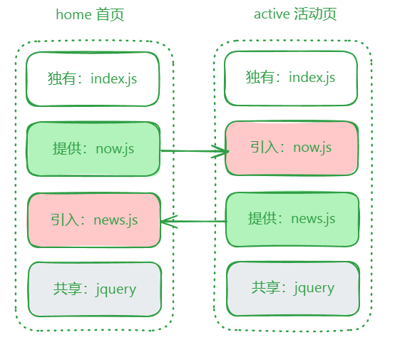

## 模块联邦

Webpack 5 的重大更新之一

在大型项目中，往往会把项目中的某个区域或功能模块作为**单独**的项目开发，形成**微前端**的架构

> 独立表现为：团队、技术栈、开发运维、测试、部署等方面都是独立的

模块联邦主要为了解决**独立子项目之间的代码共享**与**公共模块重复打包**等问题

核心思路就是借助 `ModuleFederationPlugin` 插件，分别配置**引入**（`remotes`）与**提供**（`name`、`filename`、`exposes`）的模块路径，以及**共享**路径（`shared`）

## 示例

现有两个微前端工程，它们各自独立开发、测试、部署，但它们有一些相同的公共模块，并有一些自己的模块需要分享给其他工程使用，同时又要引入其他工程的模块



### 初始化工程

#### home项目

安装

```bash
npm init -y
npm i -D webpack webpack-cli webpack-dev-server html-webpack-plugin
npm i jquery
```

修改 `package.json`

```json
"scripts": {
	"build": "webpack",
	"dev": "webpack serve"
}
```

配置 `webpack.config.js`

```js
const HtmlWebpackPlugin = require('html-webpack-plugin')
module.exports = {
	entry: './src/index.js',
	mode: 'development',
	devtool: 'source-map',
	devServer: {
		port: 8080
	},
	output: {
		clean: true
	},
	plugins: [new HtmlWebpackPlugin()]
}
```

代码

```js
// src/now.js
import $ from 'jquery'
export default function (container) {
  const p = $('<p>').appendTo(container).text(new Date().toLocaleString())
  setInterval(function() {
    p.text(new Date().toLocaleString())
  }, 1000)
}

// src/bootstrap.js
import $ from 'jquery'
import now from './now'
// 生成首页标题
$('<h1>').text('首页').appendTo(document.body)
// 首页中有一个显示当前时间的区域
now($('<div>').appendTo(document.body))

// src/index.js
// 这里使用动态异步引入
// 因为微前端的形式共享代码，一定是异步的
import('./bootstrap')
```

#### active 项目

安装

```bash
npm init -y
npm i -D webpack webpack-cli webpack-dev-server html-webpack-plugin
npm i jquery
```

修改 `package.json`

```json
"scripts": {
	"build": "webpack",
	"dev": "webpack serve"
}
```

配置 `webpack.config.js`

```js
const HtmlWebpackPlugin = require('html-webpack-plugin')
module.exports = {
	entry: './src/index.js',
	mode: 'development',
	devtool: 'source-map',
	devServer: {
		port: 3000
	},
	output: {
		clean: true
	},
	plugins: [new HtmlWebpackPlugin()]
}
```

代码

```js
// src/news.js
import $ from 'jquery'
export default function (container) {
  const ul = $('<ul>').appendTo(container)
  let html = ''
  for(var i = 1; i <= 20; i++) {
    html += `<li>新闻${i}</li>`
  }
  ul.html(html)
}

// src/bootstrap.js
import $ from 'jquery'
import news from './news'
// 生成活动页标题
$('<h1>').text('活动页').appendTo(document.body)
// 活动页中有一个新闻列表
news($('<div>').appendTo(document.body))

// src/index.js
import('./bootstrap')
```

### 暴露和引用模块

#### active 项目需要使用 home 项目的 now 模块

home 项目暴露 now 模块

```js
// webpack.config.js
const ModuleFederationPlugin = require('webpack/lib/container/ModuleFederationPlugin')
module.exports = {
  plugins: [
    new ModuleFederationPlugin({
      // 模块联邦的名称
      // 该名称将成为一个全局变量，通过该变量可获取当前联邦的所有暴露模块
      name: 'home',
      // 模块联邦生成的文件名，全部变量将植入到该文件中
      filename: 'home-entry.js',
      // 模块联邦暴露的所有模块
      exposes: [
        // key: 相对于模块联邦的路径，例如 ./now 表示该模块的访问路径为 home/now
        // value: 模块在本项目的具体路径
        './now': './src/now.js'
      ]
    })
  ]
}
```

active 项目引入 now 模块

```js
// webpack.config.js
const ModuleFederationPlugin = require('webpack/lib/container/ModuleFederationPlugin')
module.exports = {
  plugins: [
    new ModuleFederationPlugin({
      // 远程使用其他项目暴露的模块
      remotes: {
        // key: 自定义远程暴露的联邦名，相当于重新命名
        // value: 模块联邦名@模块联邦访问地址
        home: 'home@http://localhost:8080/home-entry.js'
      }
    })
  ]
}

// src/bootstrap.js
// 远程引入时间模块
import now from 'home/now'
now($('<div>').appendTo(document.body))

```

#### home 项目需要使用 active 项目的 news 模块

同上

### 处理共享模块

共享模块和项目本身都用到了 `jquery` 库，为了避免重复，可以同时为双方使用 `shared` 配置共享模块

```js
const ModuleFederationPlugin = require('webpack/lib/container/ModuleFederationPlugin')
module.exports = {
  plugins: [
    new ModuleFederationPlugin({
      // 配置共享模块
      shared: {
        jquery: {
          singleton: true
        }
      }
    })
  ]
}
```


