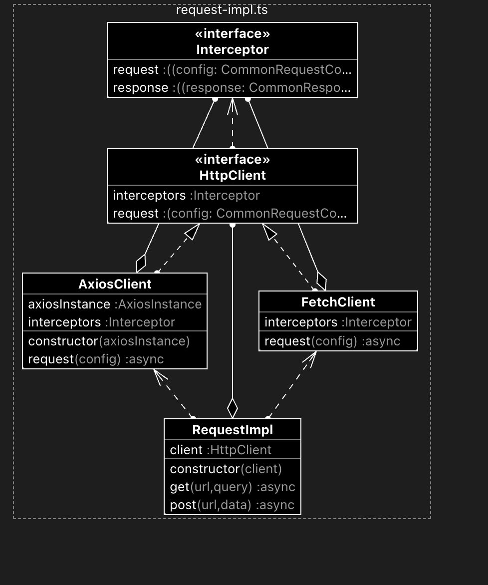

## 背景

虽然前端具有诸多成熟的请求库，但在实际项目开发中发现，它们很难完全契合实际的开发需求。

**axios**

axios 虽然很成熟，但它只是一个请求基础库，没有提供诸多的上层功能，比如请求重试、请求缓存、请求幂等、请求并发、请求轮询等

**VueRequest / SWR**

二者都属于上层应用库，它们虽然提供的功能很多，但仍然存在诸多问题：

1. 与上层框架过度绑定导致开发场景受限，也无法提供统一的API
2. 成熟度不够，issue 的回复也难以做到及时，存在一定风险
3. 它们没有聚合基础请求库，仍然需要手动整合
4. 公共库不包含公司内部制定的协议规范（例如权限请求头，统一的错误处理，统一的接口规范等），即便使用公共库，也必须针对它们做二次封装。

**综上，需要自行封装一套适配公司业务的前端请求库**

## 方案和实现

### 库结构设计

包含两层

- `request-impl`： 请求实现层，封装请求基本功能，比如请求的发送与响应的获取、拦截器、取消请求等
- `request-core`： 请求核心层，基于请求实现层，提供网络应用层控制，比如请求串行、请求并行、请求重试、请求防重等功能

### 请求实现层

封装请求基础库 RequestImpl，兼容 fetch 和 axios，通过类型规范，抹平二者使用时的差异

根据公司规范，封装通用的请求配置、响应体结构及拦截器类型，作为 RequestImpl 所实现的接口（HttpClient）

提供通用的请求实例及请求方法，同时在拦截器中封装统一的权限请求头及错误处理逻辑

代码结构如下：



```ts
import type { AxiosInstance } from 'axios'

type FetchInstance = typeof fetch

interface CommonRequestConfig {
  url: string
  method: string
  headers?: Record<string, string>
  body?: any
}

interface CommonResponse<R> {
  data: R
  status: number
  statusText: string
}

interface Interceptor<R> {
  request?: (config: CommonRequestConfig) => CommonRequestConfig
  response?: (response: CommonResponse<R>) => CommonResponse<R>
}

interface HttpClient<R> {
  request: (config: CommonRequestConfig) => Promise<CommonResponse<R>>
  interceptors?: Interceptor<R>
}

class AxiosClient<R> implements HttpClient<R> {
  axiosInstance: AxiosInstance
  interceptors?: Interceptor<R>

  constructor(axiosInstance: AxiosInstance) {
    this.axiosInstance = axiosInstance
  }

  async request(config: CommonRequestConfig): Promise<CommonResponse<R>> {
    const finalConfig = this.interceptors?.request ? this.interceptors.request(config) : config

    const response = await this.axiosInstance.request<R>({
      ...finalConfig,
      params: config.method === 'get' ? config.body : undefined,
      data: config.method === 'post' ? config.body : undefined,
    })

    const commonResponse = {
      data: response.data,
      status: response.status,
      statusText: response.statusText,
    }

    return this.interceptors?.response ? this.interceptors.response(commonResponse) : commonResponse
  }
}

class FetchClient<R> implements HttpClient<R> {
  interceptors?: Interceptor<R>

  async request(config: CommonRequestConfig): Promise<CommonResponse<R>> {
    // 应用请求拦截器
    const finalConfig = this.interceptors?.request ? this.interceptors.request(config) : config

    const init: RequestInit = {
      method: finalConfig.method,
      headers: finalConfig.headers,
      body: finalConfig.method === 'post' ? JSON.stringify(finalConfig.body) : undefined,
    }

    const response = await fetch(config.url, init)

    const data = await response.json() as R

    const commonResponse = {
      data,
      status: response.status,
      statusText: response.statusText,
    }

    return this.interceptors?.response ? this.interceptors.response(commonResponse) : commonResponse
  }
}

export class RequestImpl<R = unknown> {
  client: HttpClient<R>

  constructor(client: AxiosInstance | FetchInstance) {
    if ('request' in client)
      this.client = new AxiosClient(client as AxiosInstance)
    else
      this.client = new FetchClient()
  }

  async get(url: string, query?: Record<string, any>): Promise<CommonResponse<R>> {
    return this.client.request({
      url,
      method: 'get',
      body: query,
    })
  }

  async post(url: string, data?: Record<string, any>): Promise<CommonResponse<R>> {
    return this.client.request({
      url,
      method: 'post',
      body: data,
    })
  }
}
```

### 请求核心层

基于请求实现层，封装应用层的功能，提供网络应用层控制，例如请求重试、请求缓存、请求幂等、请求并发、请求轮询。

#### 请求重试

接收重试次数及重试间隔时间

内部使用 `while` 循环来尝试发送请求,直到达到最大重试次数。

如果请求失败,则等待一段时间后再次尝试。

如果重试次数达到上限,则抛出一个错误。

```js
async requestWithRetry(request, maxRetries = 3, retryDelay = 1000) {
  let retried = 0
  let res: any 
  while (retried < maxRetries) {
    try {
      res = await request()
      return res
    } catch(err) {
      retried++
      console.error(err)
      await new Promise(resolve => setTimeout(resolve, retryDelay))
    }
  }
  throw new Error('已达到最大请求数量')
}
```

#### 请求缓存

接收是否缓存请求的配置

定义重复请求： **请求方法、请求头、请求体完全一致**

因此使用 hash 将它们编码成一个字符串，作为缓存的 key

```js
function hashRequest(req){
  const spark = new SparkMD5();
  spark.append(req.url);
  for(const [key, value] of req.headers){
    spark.append(key);
    spark.append(value);
  }
  spark.append(req.body);
  return spark.end();
}
```

如果命中缓存，则无需请求，直接返回缓存中的数据

#### 请求幂等

基于请求缓存来实现，默认缓存的请求就是支持幂等的

#### 请求轮询

接收轮询间隔、回调函数

使用 while 循环控制轮询，使用 Promise 结合 setTimeout 控制轮询间隔

```js
async requestWithPolling(request, interval, callback) {
  let flag = true
  while (flag) {
    try {
      const res = await request()
      await new Promise(resolve => setTimeout(resolve, interval))
      callback(res)
    } catch (err) {
      flag = false
      console.error(err)
    }
  }
 }
```

#### 请求并发

简单实现就用 Promise.all

如果需要支持最大并发数的限制、细粒度的错误处理或者返回顺序严格一致的情况下，自行封装 concurRequest 方法即可

```js
async requestWithConcur(requests, maxNum = 2) {
  if (requests.length === 0) return Promise.resolve([])
  return new Promise((resolve) => {
    let index = 0
    const result: any[] = []
    let doneCount = 0
    async function _request() {
      const i = index
      index++
      const req = requests[i]
      try {
        const res = await req()
        result[i] = res
      } catch (err) {
        result[i] = err
      } finally {
        doneCount++
        if (doneCount === requests.length) {
          resolve(result)
        }
        if (index < requests.length) {
          _request()
        }
      }
    }
    for (let i = 0; i < Math.min(requests.length, maxNum); i++) {
      _request()
    }
  })
}
```

## 总结

业务开发人员再也无须关心任何的请求，只需调用请求库的业务函数即可，无须关心内部的并发、幂等这些复杂问题，这些事情对业务开发人员完全无感

整个请求库为公司的业务开发带来30%的效率提升

### 后续计划

当项目中的接口数量非常庞大时，为了减少开发和维护成本，可以用 node 实现一个自动化工具，通过解析接口标准文档，自动为每个接口生成请求样板代码。

如果某些样板代码不符合实际需要，可以基于样板代码打补丁，利用 ESModule 的特性，后面导出的会覆盖前面的同名数据导出。这样既减少了开发量，同时也保证了灵活度。

依靠自动生成的样板代码，能够减少 50% 的接口联调的时间。

更新：可以使用 [swagger-taxos-codegen](https://github.com/michalzaq12/swagger-taxos-codegen) 


