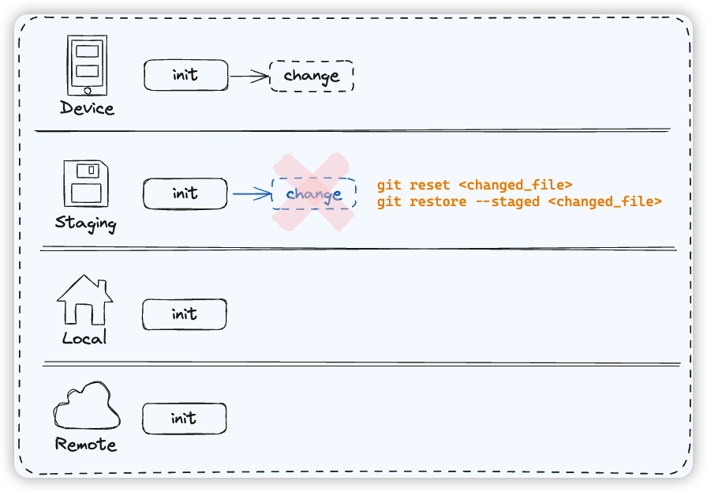

git 中与撤销或者恢复相关的指令主要包括 `reset`、`restore` 和 `revert`，下面我们根据它们在实际开发流程中的作用范围及影响结果来展开讨论

我们的代码提交过程一共会涉及到四个区域，分别是本地硬盘 `Device`、暂存区 `Staging`、本地仓库 `Local` 以及远程仓库 `Remote`

假设我们目前每个区域的 commit 是同步的，都有一个 `init` commit

### 撤销本地硬盘改动

当本地代码改动后，因为目前的改动仅存在于本地硬盘中，所以我们可以使用 `git checkout <changed_file>` 或者 `git restore <changed_file>` 撤销目前为止本地硬盘中对代码的改动

### 撤销暂存区改动

当我们完成了对文件的修改，并使用 `git add` 将改动提交到了暂存区 Staging时，此时

- 如果我们想从暂存区中移除文件，但保留硬盘上的数据，即撤销 git add 的操作时，可以使用 `git reset <changed_file>` 或者 `git restore --staged <changed_file>`

- 如果我们想将暂存区包括硬盘上的改动**全部撤销**，可以使用 `git checkout HEAD <changed_file>`

### 撤销本地 commit

当我们使用 git commit 将改动提交后，此时

- 如果我们仅撤销 commit，保留暂存区以及硬盘中的改动，可以使用 `git reset --soft HEAD~1`

- 如果我们既撤销了 commit 也撤销了暂存区，仅保留硬盘上的改动，可以使用 `git reset HEAD~1`

- 如果我们想把 commit、暂存区和本地硬盘的改动**全部**清空，可以使用 `git reset --hard HEAD~1`

### Revert

对于已经被 commit 的改动，还有一个 `git revert HEAD` 命令也可以用于撤销

> git revert HEAD 表示前一次提交的指针，也可以直接将提交的 hash 作为参数，例如 git revert 70a0

与 git reset 不同，git revert 命令本质上是在给我们**新增**一个 commit，用于**抵消**之前某次 commit 的改动

而且 reset 命令只能回到之前某个 commit 的状态，而 revert 可以撤销 commit chain 中间任意一个 commit

### 撤销远端提交

revert 还有一个更重要的好处：

当我们使用 git push 将改动推到了远端仓库后，想要撤回这次提交，此时

- 如果是个人分支，随便搞，可以使用 `git reset --hard HEAD~1` 然后 `git push -f` 强制将改动同步到远端

- 如果是公用分支，为了不影响到其他开发者，只能使用 `git revert` 然后 `git push`，从过程上看是新增了一个 commit，但从结果上看是撤回了上一次的改动

