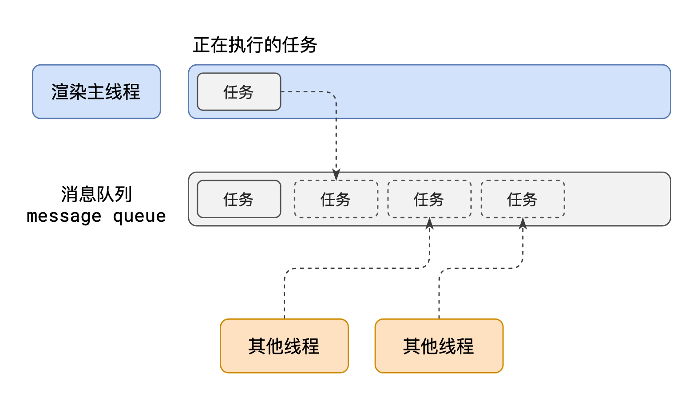
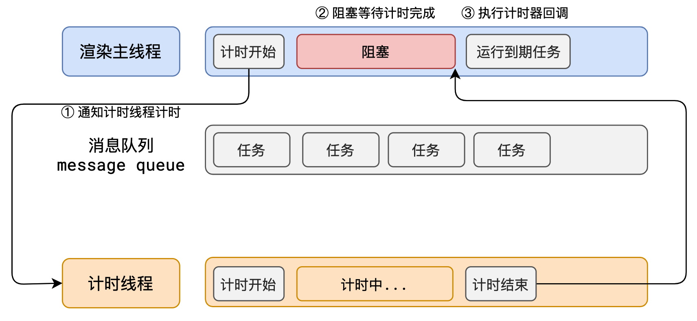

## 1 浏览器的进程模型

### 1.1 进程与线程

#### 进程

程序运行需要有它自己专属的内存空间，可以把这块**内存空间**简单的理解为**进程**

每个应用**至少有一个进程**，进程之间**相互独立**，即使要通信，也需要**双方**同意。

有了进程后，就可以运行程序的代码了。

#### 线程

如果将进程比作运行应用的*工厂*，那么运行代码的*工人*就相当于**线程**。

一个进程**至少有一个线程**，所以在进程开启后会自动创建一个线程来运行代码，该线程称之为**主线程**。

如果程序需要**同时执行**多块代码，主线程就会启动更多的线程来执行代码，所以一个进程中可以包含多个线程。

### 1.2 浏览器的进程与线程

浏览器是一个**多进程多线程**的应用程序

为了避免相互影响，为了减少连环崩溃的几率，当启动浏览器后，它会自动启动多个进程。
> 可以在浏览器的任务管理器中查看当前的所有进程

其中，最主要的进程有：

1. 浏览器进程

   主要负责界面显示、用户交互、子进程管理等。浏览器进程内部会启动多个线程处理不同的任务。

2. 网络进程

   负责加载网络资源。网络进程内部会启动多个线程来处理不同的网络任务。

3. **渲染进程**

   默认情况下，浏览器会为**每个标签页**开启一个**新的渲染进程**，以保证不同的标签页之间不相互影响。

   > 将来该默认模式可能会有所改变，有兴趣的同学可参见[chrome官方说明文档](https://chromium.googlesource.com/chromium/src/+/main/docs/process_model_and_site_isolation.md#Modes-and-Availability)

   渲染进程启动后，会开启一个**渲染主线程**，主线程负责执行 HTML、CSS、JS 代码。

## 2 渲染主线程

渲染主线程是浏览器中最繁忙的线程，需要它处理的任务包括但不限于：

- 解析 HTML
- 解析 CSS
- 计算样式
- 布局
- 处理图层
- 每秒把页面画 60 次
- 执行全局 JS 代码
- 执行事件处理函数
- 执行计时器的回调函数
- ......

> 思考题：为什么渲染进程不适用多个线程来处理这些事情？
>
> 虽然使用其他线程来分担渲染主线程的工作是一种常见的优化策略，但这并不是完全可行的。
>
> 首先，浏览器中的许多操作必须在渲染主线程上执行，例如DOM操作和重绘。如果将这些操作移动到其他线程中，可能会导致界面出现卡顿、闪烁等不良效果。（渲染主线程的核心职责就是渲染界面）
>
> 其次，多线程编程本身就存在着一些问题，例如线程同步、共享数据安全等。为了避免这些问题，开发人员需要花费更多的精力来设计和实现多线程架构，从而增加了开发成本和难度。
>
> 因此，对于大多数Web应用程序来说，在渲染主线程之外开启额外的线程并不会带来显著的性能提升，反而可能会引入更多的问题。相反，通过采用一些优化策略（例如减少DOM的使用、使用合适的CSS布局技术、避免强制同步布局等），可以更有效地提高页面的性能和响应速度。

要处理这么多的任务，主线程遇到了一个前所未有的难题：**如何调度任务**？

比如：

- 我正在执行一个 JS 函数，执行到一半的时候用户点击了按钮，我该立即去执行点击事件的处理函数吗？
- 我正在执行一个 JS 函数，执行到一半的时候某个计时器到达了时间，我该立即去执行它的回调吗？
- 浏览器进程通知我“用户点击了按钮”，与此同时，某个计时器也到达了时间，我应该处理哪一个呢？
- ......

渲染主线程想出了一个绝妙的主意来处理这个问题：**排队**



1. 在最开始的时候，渲染主线程会进入一个无限循环（`for(;;)`）
2. 每一次循环会检查消息队列中是否有任务存在。如果有，就取出第一个任务执行，执行完一个后进入下一次循环；如果没有，则进入休眠状态。
3. 其他所有线程（包括其他进程的线程）可以随时向消息队列添加任务。新任务会加到消息队列的末尾。在添加新任务时，如果主线程是休眠状态，则会将其唤醒以继续循环拿取任务

这样一来，就可以让每个任务有条不紊的、持续的进行下去了。

**整个过程，被称之为事件循环（消息循环）**

### 2.1 何为异步

> 解决由于同步导致的渲染主线程阻塞的方案。

代码在执行过程中，会遇到一些**无法立即处理的任务**，比如：

- 计时完成后需要执行的任务 —— `setTimeout`、`setInterval`
- 网络通信完成后需要执行的任务 -- `XHR`、`Fetch`
- 用户操作后需要执行的任务 -- `addEventListener`

如果让渲染主线程等待这些任务的时机达到，就会导致主线程长期处于「阻塞」的状态，从而导致浏览器「卡死」



**渲染主线程承担着极其重要的工作，无论如何都不能阻塞！**

因此，浏览器选择**异步**方案来解决这个问题


使用异步的方式，**渲染主线程永不阻塞**

### 2.2 任务的优先级

任务没有优先级，在消息队列中先进先出

但**消息队列是有优先级的**

根据 W3C 的最新解释:

- 每个任务都有一个任务类型，同一个类型的任务必须在一个队列，不同类型的任务可以分属于不同的队列。
  在一次事件循环中，浏览器可以根据实际情况从不同的队列中取出任务执行。
- 浏览器必须准备好一个微队列，微队列中的任务优先所有其他任务执行
  https://html.spec.whatwg.org/multipage/webappapis.html#perform-a-microtask-checkpoint

> 随着浏览器的复杂度急剧提升，W3C 不再使用宏队列的说法

在目前 chrome 的实现中，至少包含了下面的队列：

- 延时队列：用于存放计时器到达后的回调任务，优先级「中」
- 交互队列：用于存放用户操作后产生的事件处理任务，优先级「高」
- 微队列：用户存放需要最快执行的任务，优先级「最高」

> 添加任务到微队列的主要方式主要是使用 Promise、MutationObserver
>
> 例如：
> ```js
>// 立即把一个函数添加到微队列
> Promise.resolve().then(函数)
> ```

> 浏览器还有很多其他的队列，由于和我们开发关系不大，不作考虑

## 3 面试题

### 3.1 如何理解 JS 的异步？

> 单线程(渲染主线程)

**JS是一门单线程的语言**，这是因为它运行在浏览器的（渲染进程中的）渲染主线程中，而**渲染主线程只有一个**。

而渲染主线程承担着诸多的工作，渲染页面、执行 JS 都在其中运行。

> 同步 = 阻塞

如果使用同步的方式，就极有可能导致主线程产生**阻塞**，从而导致消息队列中的很多其他任务无法得到执行。这样一来，一方面会导致繁忙的主线程白白的消耗时间，另一方面导致页面无法及时更新，给用户造成卡死现象。

> 异步 = 解决阻塞的方案/模式

所以浏览器采用异步的方式来避免。具体做法是当某些任务（比如计时器、网络、事件监听）发生时，主线程将任务交给其他线程去处理，自身立即结束任务的执行，转而执行后续代码。当其他线程完成时，将事先传递的回调函数**包装**成**任务**，加入到消息队列的末尾**排队**，等待主线程调度执行。

> 事件循环就是**异步调度任务**的实践方案

在这种异步模式下，浏览器永不阻塞，从而最大限度的保证了单线程的流畅运行。

### 3.2 阐述一下 JS 的事件循环

>事件循环是浏览器**渲染主线程**的工作机制

事件循环又叫做**消息循环**，是浏览器**渲染主线程的工作方式/机制**。

> 渲染主线程开启一个死循环，轮询消息队列；其他线程在合适的时机将（回调函数包装成）任务加入到消息队列即可

在 Chrome 的源码中，它开启一个不会结束的 for 循环，每次循环从消息队列中取出第一个任务执行，而其他线程只需要在合适的时候将任务加入到队列末尾即可。

> 没有宏任务的概念了，又细分了多种任务类型，不过仍然是微任务优先级最高（微 > 交互 > 延时）
>
> 做面试题的话，还是按宏任务微任务划分即可

过去把消息队列简单分为宏队列和微队列，这种说法目前已无法满足复杂的浏览器环境，取而代之的是一种更加灵活多变的处理方式。

根据 W3C 官方的解释，每个任务有不同的类型（例如延时任务、交互任务），同类型的任务必须在同一个队列，不同的任务可以属于不同的队列。不同任务队列有不同的优先级，在一次事件循环中，由浏览器自行决定取哪一个队列的任务。**但浏览器必须有一个微队列**，微队列的任务一定具有**最高**的优先级，必须优先调度执行。

### 3.3 如果宏微任务队列空了，会发生什么

**一帧时间**内，task 和 micro task 执行完：

> 微 -> 宏 -> rAF -> 渲染 -> GC -> rIC -> IDLE

- 在微任务全部执行完后，如果有通过 `requestAnimationFrame `注册的回调函数，这些函数会在下一次重绘之前被调用。它们主要用于进行动画相关的计算和DOM操作。

- 如果在执行 task、micro task 和 rAF 之后，DOM 被修改了，或者 CSS 样式有改变，或者有其他影响视觉输出的操作，浏览器可能会进行页面渲染更新。

- 如果在当前帧有剩余的时间，浏览器可能会执行一些低优先级的任务，如 `GC`（垃圾回收）或执行通过 `requestIdleCallback` 注册的回调。如果没有什么任务需要执行，浏览器就会进入空闲状态，等待下一帧或者下一个宏任务

### 3.4 JS 中的计时器能做到精确计时吗？为什么？

不行，因为：

1. 计算机硬件没有原子钟，无法做到精确计时
2. 操作系统的计时函数本身就有少量偏差，由于 JS 的计时器最终调用的是操作系统的函数，也就携带了这些偏差
3. 按照 W3C 的标准，浏览器实现计时器时，如果嵌套层级超过 5 层，则会带有 4 毫秒的最少时间，这样在计时时间少于 4 毫秒时又带来了偏差
4. 受**事件循环**的影响，计时器的回调函数只能在渲染主线程**空闲**时运行，因此又带来了偏差

### 3.5 打印顺序

```javascript
console.log(1);

setTimeout(() => console.log(2));

Promise.resolve().then(() => console.log(3));

Promise.resolve().then(() => setTimeout(() => console.log(4)));

Promise.resolve().then(() => console.log(5));

setTimeout(() => console.log(6));

console.log(7);
```

再来

```js
console.log(1)
setTimeout(() => {
    console.log(2)
    new Promise((resolve, reject) => {
        console.log(3)
        resolve(4)
    }).then((res) => {
        console.log(res) 
    })
}, 0)
new Promise((resolve, reject) => {
    console.log(5)
    resolve()
}).then(() => {
    console.log(6)
    setTimeout(() => {
        console.log(7)
    })
    return Promise.resolve(8)
}).then(res => {
    console.log(res);
})
console.log(9)
```

1. 如果 Promise 没有（执行到） `resolve()`，那么 `then` 回调就**不会**进入微队列
2. async 函数中 `return "xxx"` 关键字会使得这个函数返回一个立即解析为 `"xxx"` 的 `Promise`

### 3.6 async await

`async` 和 `await` 是 JavaScript 中用于处理**异步编程**的**关键字**，它们使得异步代码的编写和阅读变得更加直观和简洁。

- **async**：用于**定义一个异步函数**。异步函数会**返回一个 Promise** 对象，函数内部的代码可以使用 `await` 关键字来暂停执行，直到 Promise 被解决（fulfilled）或拒绝（rejected）。
- **await**：用于等待一个 Promise 的解决。它只能在 `async` 函数内部使用。当执行到 `await` 时，函数会暂停，直到 Promise 解决后再继续执行后面的代码。

在事件循环中的分析思路：

1. 当调用一个 `async` 函数时，函数体内的代码会立即执行，直到遇到第一个 `await`。
2. 遇到 `await` 时，函数会暂停执行，并将控制权返回给调用者。
3. 当 Promise 被解决后，事件循环会将控制权返回给 `async` 函数，继续执行 `await` 后面的代码。

```js
async function async1(){
  console.log('async1 start');
  let res = await async2(); // 去 async2 继续执行
  // 后续代码包括 res 的赋值，都要进微队列，等 async2 settle 之后
  console.log(res);
  console.log('async1 end');
}

async function async2(){
  console.log('async2 start');
  return 'async2 end'
  // 相当于 async2 返回了 Promise.resolve('async2 end')
}

console.log('script start');
setTimeout(() => {
  console.log('setTimeout');
}, 0);
async1();
new Promise((resolve,reject) => {
  console.log('Promise start');
  resolve();
}).then(() => {
  console.log('Promise end');
})
console.log('script end');
```

## 4 Nodejs 中的 EventLoop

### 4.1 综述

Nodejs 使用 V8 作为 JS 的解析引擎，而 IO 处理使用了自己设计的 libuv，事件循环机制就是其内部实现

分为**六个**阶段，除去内部使用的阶段，学习者只需关注其中三个阶段

- **timers 阶段**：执行 setTimeout、setInterval 回调
- **poll 阶段**：获取新的 io 事件，适当的条件下 Nodejs 将阻塞在这里
- **check 阶段**：执行 setImmediate 回调

事件循环的执行顺序：

外部输入数据 -> 轮询poll -> check -> timer -> poll

清空微队列的时机：与浏览器一致，**在执行任务前，都要先清空微队列**

### 4.2 注意事项

- **定时器时间**

nodejs 中定时器指定的时间也不是准确时间，只能说尽快执行，因为事件循环 poll 阶段的执行时间不确定，可能会堵塞进入 timer 阶段

- **常见微任务**

Promise.then()

process.nextTick()

后者比前者优先级更高，可以理解为 pn 进入了 nextTick 队列，独立于微队列

```js
setTimeout(() => {
  console.log('timer1')
  Promise.resolve().then(() => {
    console.log('promise1')
  })
  process.nextTick(() => {
    console.log('next tick1')
  })
  Promise.resolve().then(() => {
    console.log('promise2')
  }) 
  process.nextTick(() => {
    console.log('next tick2')
  })
})

setTimeout(() => {
  console.log('timer2')
  Promise.resolve().then(() => {
    console.log('promise3')
  })
})
```

- **setTimeout0 与 setImmediate 先后顺序不确定**

但在 **io 回调**中，setImmediate 一定比 setTimeout0 **更早**，因为 io 事件处理是在 poll 阶段，紧接着就是 check 阶段，最后才是 timer 阶段

### 4.3 对比

机制类似，侧重不同

最直观的对比就是循环的阶段比浏览器多，自然地就把宏任务也做了区分，并有了先后顺序

在 Node.js 中，事件循环的实现依赖于 libuv 库，这使得 Node.js 能够处理文件系统、网络请求等 I/O 操作。Node.js 的事件循环有多个阶段，每个阶段处理特定类型的任务。例如，定时器阶段处理定时器回调，I/O 回调阶段处理 I/O 事件，微任务队列在每个宏任务完成后被清空

相较之下，浏览器的事件循环主要用于处理用户界面事件，如鼠标点击和键盘输入。浏览器的事件循环也会在每个宏任务完成后清空微任务队列，但它的实现与 Node.js 不同，因为浏览器还需要**处理渲染和绘制**等任务。浏览器的事件循环通常会在每个事件循环周期中进行一次渲染，确保用户界面能够及时更新

总结来说，Node.js 和浏览器的事件循环在处理异步任务的基本机制上是相似的，都是在完成一个任务后清空微任务队列。然而，它们的实现细节和处理的任务类型有所不同，**Node.js 更加专注于服务器端的 I/O 操作，而浏览器则更注重用户界面的交互和渲染。**

