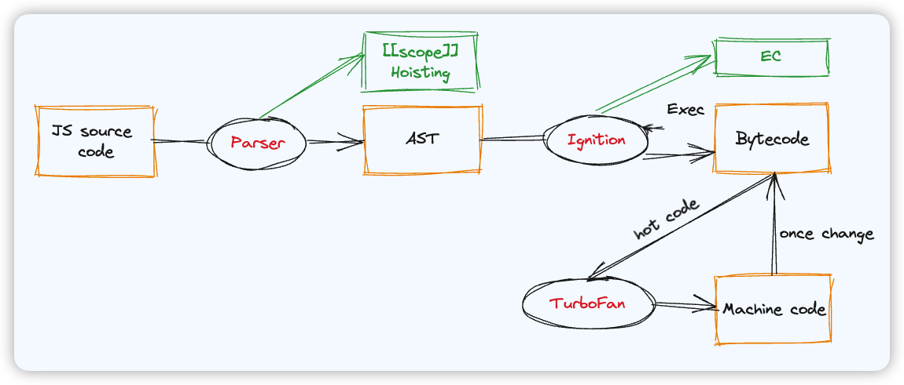

JS 引擎有三大核心组件：**解析器**（Parser）、**解释器**（Ignition）、和**编译器**（TurboFan)

1. 源码首先进入解析器，将源码经过**词法分析**和**语法分析**后解析为 **AST**。这个过程同时也会发生**变量提升**，**作用域链机制**也在这里体现

2. 解释器首先将 AST 转换为**字节**码，然后**逐行执行**。这个过程同时也会生成**执行上下文对象**

>说编译器之前，首先介绍下字节码和机器码
>
>- 字节码不占空间，但是执行慢
>
>- 机器码占空间，但是执行快
>
>二者结合的方案就是 **JIT**（Just In Time），这时编译器就闪亮登场了

3. 当 JS 引擎中的监控模块发现一段代码被多次调用，就会被标记为**热代码**。编译器就会将这段热代码编译为机器码缓存下来，供下次调用。提升执行效率
