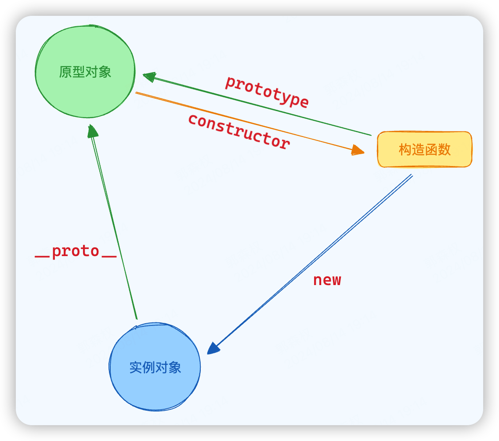

> 省流：
>
> 原型和原型链是 JS **实现面向对象**的手段。
>
> - 每个对象都有一个 `__proto__` 属性，该属性指向自己的原型对象
>
> - 每个构造函数都有一个 `prototype` 属性，该属性指向实例对象的原型对象
>   - 即 `实例.__proto__ === 构造函数.prototype`
>
> - 原型对象的 `constructor` 指向构造函数本身
>
> 
>
> 每个对象都有自己的原型对象，而原型对象本身也有自己的原型对象，从而形成了一条链条
>
> 当试图访问一个对象的属性时，不仅会找对象的自有属性，也会顺着原型链找这个属性

## 1 原型链

### 1.1 什么是原型链（举例）

- JS中一切皆对象，只要是对象就有一个隐藏属性`__proto__`（Object.prototype除外），指向（全等于）其**构造函数的原型**（`prototype`）

  - `children.__proto__ === Parent.protytpe`

- `__proto__` 属性的作用就是指向对象的原型的，告诉对象其**构造函数的原型**是谁

- 比如说有个数组 a，那么 a 的隐藏属性`__proto__`指向 a 构造函数的原型，即`Array.prototype`，而 Array.prototype 也有隐藏属性`__proto__`，指向`Object.prototype`，因为全部对象的祖先原型都是 Object.prototype

  ```js
  a.__proto__ === Array.prototype; 
  Array.prototype.__proto__ === Object.prototype
  ```

- 至此，数组 a、Array.prototype 与Object.prototype 就通过隐藏属性`__proto__`形成了一条**原型链**

- 特点

  - **函数本身**作为**自身原型对象**的**构造函数**
  - 实例的`__proto__`属性（原型）**等于**其构造函数的`prototype`属性
  - 所有对象的祖先原型都是`Object.prototype`

### 1.2 如何实现原型链

- 访问原型对象的方式

  - `构造函数.prototype`

  - `实例对象.__proto__`（不推荐）

  - `Object.getPrototypeOf(实例对象)`（推荐）

- **原型链实现的本质就是改变对象的隐藏属性`__proto__`，使其指向另外一个对象**
- 但不推荐直接赋值更改
  1. `const x = Object.create(新原型对象)`
  2. `const x = new 新原型的构造函数()`

### 1.3 优点/意义

- 原型与原型链在 JS 中的唯一作用/意义就是**实现面向对象**

- 在没有 Class 的情况下实现**继承**，比如 `[] => Array.prototype => Object.prototype` 的原型链


### 1.4 缺点

- 不支持私有属性，只能靠**下划线**作为前缀来约定私有属性（在 class 中利用`#`作为前缀来定义私有属性）

- 写起来较复杂

## 2 继承

### 2.1 原型链继承

- **子类的原型**对象指向**父类的实例**对象

 ```js
 // 构造函数Parent
 function Parent () {
  // 构造函数中的实例属性
  this.name = 'gsq'
  this.array = [1, 2, 3]
 }
 // 原型属性
 Parent.prototype.array2 = [4, 5, 6]
 // 原型方法
 Parent.prototype.say(){
 console.log('say something')
 }
 // 构造函数Child
 function Child () {}
 
 // 原型链继承核心
 Child.prototype = new Parent()
 // 可有可无的细节：
 // 重新建立子类实例与子类构造函数的联系
 Object.defineProperty(Child.prototype, "constructor", {
  value: Child,
  enumerable: false,
  writable: true
 })
 
 // 实例化Child
 const c1 = new Child()
 const c2 = new Child()
 // 实例对象c能够访问到Parent构造函数的实例属性以及Parent原型对象的属性
 console.log(c1.array) // [1, 2, 3]
 console.log(c2.array2) // [4, 5 ,6]
 c1.say()
 c2.say()
 
 /* 重点来啦 */
 // 尝试改变对象继承的属性
 c1.name = 'zs'
 c1.array.push(4)
 c1.array2.push(7)
 // 会发现实例对象c2继承的引用属性发生了改变
 console.log(c2.name) // 原始类型没有被影响，仍然是gsq
 console.log(c2.array) // 变为 [1, 2, 3, 4]
 console.log(c2.array2) // 变为 [4, 5 ,6 ,7]
 ```

  - 优点：实现了原型对象属性与方法的继承
  - 缺点：存在**引用类型属性共享**的问题，无法实现多继承

### 2.2 构造函数继承

- 子类构造函数借用父类构造函数

```js
// 父类构造函数
function Parent(){
  // 实例属性（引用类型）
  this.array = [1, 2, 3]
}
// 原型属性
Parent.prototype.title = 'gsq'

// 子类构造函数
function Son(){
  // * 借用父类的构造函数
  // 变更Parent执行时内部的this指向为实例对象
  Parent.call(this)
}
// 实例化
const s1 = new Son()
const s2 = new Son()
// 解决了引用值不会共享的问题
s1.array.push(4)
console.log(s2.array) // 仍然是 [1,2,3]
// 但访问不了父类原型对象的属性与方法
s2.title // undefined
```

- 优点：解决了原型链继承引用值共享的问题，可以实现多继承
- 缺点：只能继承父类的实例属性和方法，**不能继承原型对象的属性和方法**

### 2.3 组合继承（伪经典继承）

- 原型链继承结合构造函数继承

```js
function Parent(){
  // 实例属性（引用类型）
  this.array = [1, 2, 3]
}
// 原型方法
Parent.prototype.say = function (){
  console.log("say sth")
}

// 构造函数继承
function Son(){
  Parent.call(this)
}
// * 原型链继承
Son.prototype = new Parent()

const s1 = new Son()
const s2 = new Son()
// 不会出现引用类型属性共享的问题
s1.array.push(4)
console.log(s2.array) // [1,2,3]
// 同时也可以访问父类原型上的方法
s2.say() // "say sth"
```

- 优点：解决原型链继承和构造函数继承的问题
- 缺点：父类的构造函数复用的问题（执行两次）

### 2.4 寄生组合继承（经典继承）

- 利用`Object.create()`方法，指定子类原型对象的父类原型对象（不再通过父类实例）
- `var B = Object.create(A)`：以`A`对象为原型，生成了`B`对象。`B`继承了`A`的所有属性和方法。

```js
function Parent(){}
function Son(){
  Parent.call(this)
}
// * Son的原型直接继承Parent的原型
Son.prototype = Object.create(Parent.prototype)

// Object.create等同于
Object.create = function (proto) {
    function F() {}
    F.prototype = proto;
    return new F();
  };
```

- 优点：优化了组合继承中父类构造函数的复用的问题
- 缺点：重写了子类的原型，会导致子类的属性与方法无法访问

### 2.5 ES6 继承

```js
class Father {
  age = 60;
  gender = "male";
  constructor(age) {
    this.age = age;
  }
  getAge() {
    return this.age;
  }
  static getName() {
    return "father";
  }
}
class Son extends Father {
  constructor(name, age) {
    /*
    子类必须在constructor方法中调用super方法，否则新建实例时会报错。
    这是因为子类自己的this对象，必须先通过父类的构造函数完成塑造，得到与父类同样的实例属性和方法，
    然后再对其进行加工，加上子类自己的实例属性和方法。
    如果不调用super方法，子类就得不到this对象。
    */
    super(age);
    this.name = name;
  }
}
const son = new Son("gsq", 90);
console.log(son);
Son { age: 90, gender: 'male', name: 'gsq' }
```

### 面试题

```js
// 构造函数
function Foo(){
  // 挂载到 window 对象的全局函数
  // 在 Foo 函数被调用时才会声明
	getName = function(){
		cosole.log(1)
	}
	return this
}
// 静态方法
Foo.getName = function(){
	console.log(2)
}
// 原型方法
Foo.prototype.getName = function (){
	console.log(3)
}
// 函数表达式
// 函数表达式
// 解释器分析到这句才会正式给 var getName 赋值
var getName = function (){
	console.log(4)
}
// getName 函数声明，会优先提升到作用域顶端
// 会被更早覆盖掉
function getName(){
	console.log(5)
}
/*-------------------------*/
console.log(Foo()) // 独立调用执行，返回值this指向window对象 // window
Foo.getName() // 调用类的静态方法 2
```

## 3 new 做了什么

1. 创建临时对象

   ```js
   const obj = {}
   ```

2. 将临时对象的 `__proto__` 指向构造函数的原型（绑定原型，获取构造函数原型链上的共有属性）

   ```js
   obj.__proto__ = Con.prototype
   Object.setPrototypeOf(obj, Con.prototype)
   ```

3. 使用 call 或 apply 执行构造函数，将临时对象 obj 作为 this （同时赋值，获取自身属性）

   ```js
   const result = Con.apply(obj, ...args)
   ```

4. 返回结果对象

   ```js
   return result
   ```
