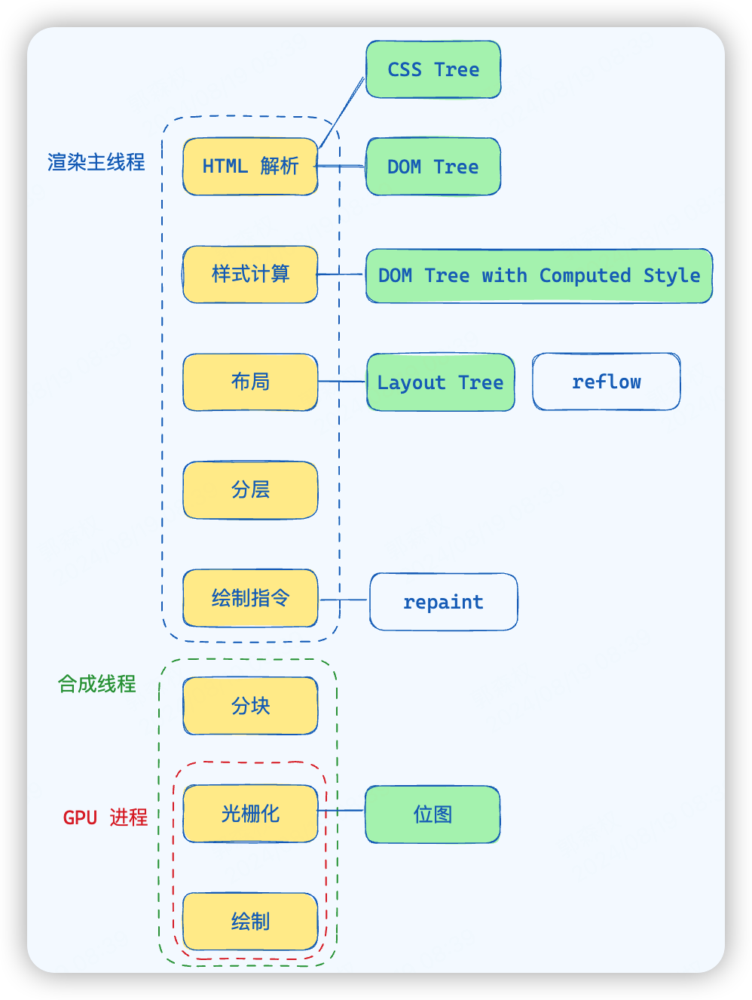

## 浏览器是如何渲染页面的？

当浏览器的*网络线程*收到 HTML 文档后，会产生一个**渲染任务**，并将其传递给*渲染主线程*的**消息队列**。

在事件循环机制的作用下，渲染主线程取出消息队列中的渲染任务，开启渲染流程。

主要有**两个线程**（渲染主线程、合成线程）和**一个进程**（GPU）参与，

可以归纳为 **8 个**步骤



rAF 在浏览器渲染主线程将绘制指令交由合成线程后执行的（AI 说的，暂未求证）

-------

整个渲染流程分为多个阶段，分别是： `HTML 解析` > `样式计算` > `布局` > `分层` > `绘制指令` > `分块` >  `光栅化` > `画`

每个阶段都有明确的输入输出，上一个阶段的输出会成为下一个阶段的输入。

这样，整个渲染流程就形成了一套组织严密的生产流水线。

-------

### 解析 HTML

> HTML字符串 => DOM Tree + CSSOM Tree

解析过程中遇到 CSS 解析 CSS，遇到 JS 执行 JS。为了提高解析效率，浏览器在开始解析前，会启动一个**预解析的线程**，率先下载 HTML 中的外部 CSS 文件和外部的 JS 文件。

> CSS 不会阻塞 HTML 解析

如果主线程解析到`link`位置，此时外部的 CSS 文件还没有下载解析好，主线程不会等待，继续解析后续的 HTML。这是因为**下载和解析 CSS 的工作是在预解析线程中进行的**。这就是 CSS 不会阻塞 HTML 解析的根本原因。

DOM 对象可以通过 `document.body` 查看与编辑；CSS 对象可以通过 `document.styleSheets` 属性查看与编辑；

> JS 会阻塞 HTML 解析

如果主线程解析到`script`位置，会停止解析 HTML，转而等待 JS 文件下载好，并将全局代码解析执行完成后，才能继续解析 HTML。这是因为 **JS 代码的执行过程可能会修改当前的 DOM 树**，所以 DOM 树的生成必须暂停。这就是 JS 会阻塞 HTML 解析的根本原因。

第一步完成后，会得到 DOM 树和 CSSOM 树，浏览器的默认样式、内部样式、外部样式、行内样式均会包含在 CSSOM 树中。

> 题外话：为什么 div 和 p 能占一行？因为浏览器默认样式（*用户代理样式表*） `display: block`

-------

### 样式计算

> DOM Tree + CSSOM Tree = DOM Tree with Computed Style

主线程会遍历得到的 DOM 树，依次为树中的每个节点计算出它最终的样式，称之为 Computed Style。

在这一过程中，很多**预设值**会变成**绝对值**，比如`red`会变成`rgb(255,0,0)`；**相对单位**会变成**绝对单位**，比如`em`会变成`px`，但对于某些百分比的长度或宽度，其结果是在下一步*布局*计算完成的

具体样式可以通过调试工具的 `Computed` 窗口查看

这一步完成后，会得到一棵**带有样式的 DOM 树**。

--------

### 布局

> DOM Tree with Computed Style => Layout Tree

布局阶段会依次遍历 DOM 树的每一个节点，计算每个节点的**几何信息**。例如节点的宽高、相对包含块的位置。

大部分时候，DOM 树和布局树**并非一一对应**。

比如 **`display:none`** 的节点没有几何信息，因此不会生成到布局树；又比如使用了**伪元素选择器**，虽然 DOM 树中不存在这些伪元素节点，但它们拥有几何信息，所以会生成到布局树中。还有匿名行盒、匿名块盒等等都会导致 DOM 树和布局树无法一一对应。

布局对象是 C++ 的对象，外部无法直接访问，只会暴露部分布局属性，例如 `document.body.clientWidth`

-----------

### 分层

> 优化重绘

主线程会使用一套复杂的策略对整个布局树中进行分层。

分层的好处在于，将来某一个层改变后，仅会对该层进行后续处理，从而提升效率。

可以通过调试工具的 `Layers` 窗口查看

滚动条、堆叠上下文（z-index）、transform、opacity 等样式都会或多或少的影响分层结果，也可以通过`will-change`属性更大程度的影响分层结果。

---------

### 绘制指令

主线程会为**每个层**单独产生**绘制指令集**，用于描述这一层的内容该如何画出来。

自此，渲染主线程的工作就结束了，剩余步骤交给其他进程或线程来完成

------

### 分块（合成线程）

完成绘制后，主线程将每个图层的绘制信息提交给合成线程（也在渲染主线程中），剩余工作将由合成线程完成。

合成线程首先对每个图层进行**分块**，将每一层划分为多个**小区域**。

它会从**线程池**（线程管理器）中拿取多个线程来完成分块工作。可以在任务管理器中找到它们（Compositor & CompositorTileWorker）

----

### 光栅化（合成线程 + GPU 进程）

合成线程会将块信息交给 **GPU 进程**，以极高的速度完成光栅化。

GPU 进程会开启多个线程来完成光栅化，并且**优先处理靠近视口区域的块**。

光栅化的结果，就是一块一块的**位图**

```
FFFF	FFFF	0000
00FF	FFFF	FFFF
```

---------

### 画（合成线程 + GPU 进程）

> 位图 => quad => GPU 进程 => GPU（外部）

合成线程拿到每个层、每个块的位图后，生成一个个「**指引**（quad）」信息。

指引会标识出每个位图应该画到屏幕的哪个位置，以及会考虑到旋转、缩放等变形。

**变形发生在合成线程，与渲染主线程无关，这就是`transform`效率高的本质原因。**

合成线程会把 quad 提交给 GPU 进程，由 GPU 进程产生系统调用，提交给 GPU 硬件，完成最终的屏幕成像。

> 为什么合成线程不直接交给GPU硬件？
>
> 因为合成线程位于浏览器的渲染进程中，而浏览器的渲染进程是与外界隔离的（沙盒），因此需要浏览器中的GPU进程来做中转

## 什么是 reflow？

reflow 的本质就是重新计算 layout 树。发生在**Layout 阶段**

当进行了会影响布局树的操作（**几何属性改变**）后，需要重新计算布局树，会引发 reflow。

> 添加或删除可见的 DOM
>
> 元素位置和尺寸改变
>
> resize 事件
>
> 改变文字大小

为了避免连续的多次操作导致布局树反复计算，浏览器会**合并**这些操作，当 JS 代码全部完成后再进行统一计算。所以，改动属性造成的 reflow 是**异步**完成的。

也同样因为如此，当 JS 获取布局属性时，就可能造成无法获取到最新的布局信息。

浏览器在反复权衡下，最终决定获取属性立即 reflow。

>  具体哪些属性可以引起reflow，可以查看[CSS Triggers List - What Kind of Changes You Can Make](https://csstriggers.com/)

## 什么是 repaint？

repaint 的本质就是重新根据分层信息计算了绘制指令。

当改动了**可见样式**后，就需要重新计算，会引发 repaint。

由于元素的布局信息也属于可见样式，所以 **reflow 一定会引起 repaint**。

>  具体哪些属性可以引起repaint，可以查看[CSS Triggers List - What Kind of Changes You Can Make](https://csstriggers.com/)

## 为什么 transform 的效率高？

因为 transform 既不会影响布局也不会影响绘制指令，它影响的只是渲染流程的最后一个「draw」阶段

由于 draw 阶段在合成线程中，所以 transform 的变化几乎不会影响渲染主线程。反之，渲染主线程无论如何忙碌，也不会影响 transform 的变化。
