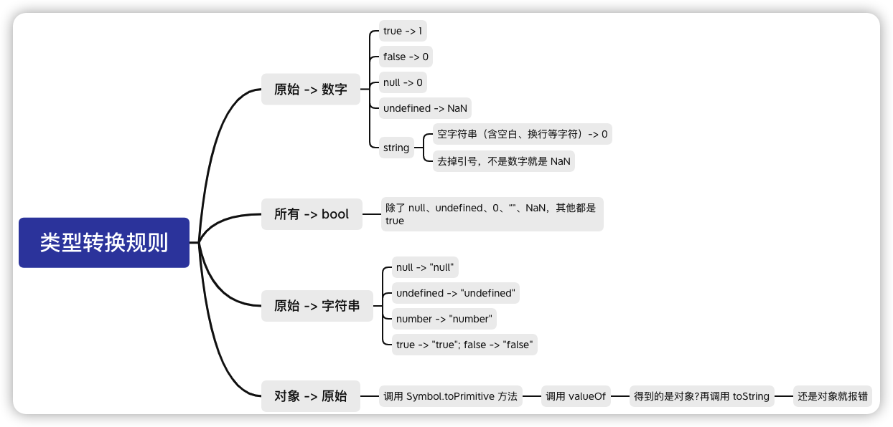
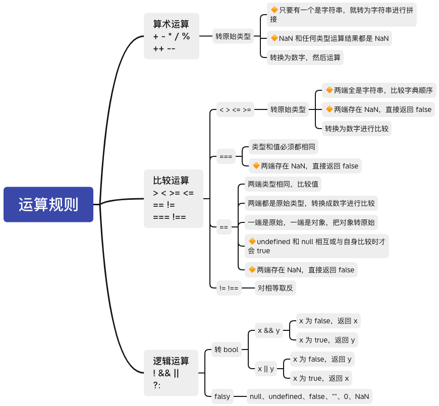

### 表达式

JS 中的数据有三种表现形式

- 字面量，例如 `'1', 2, true, [1, 2]`

- 变量，例如 `a, b`

- 表达式：**数据 + 运算符**，例如 `a&&b, 1+2, a*2`
  - 每个表达式都有**运算结果（返回值）**

### 类型转换规则



### 运算规则



### 几道题

```js
// console.log(1, 0 == '')// 1 true
// console.log(2, 0 == '0')// 2 true
// console.log(3, 2 == true) // 3 false
// console.log(4, 2 == false) // 4 false
// console.log(5, false == 'false') // 5false
// console.log(6, false == '0') // 6 true
// console.log(7, false == undefined) // 7 false
// console.log(8, false == null) // 8 false
// console.log(9, null == undefined) // 9 true
// console.log(10, ' \n\r ' == 0) // 10 true
// console.log(11, null + '1' == null + 1) // 'null1' == 1 // 11 false
// console.log(12, null + 1 == 1) // 12 true
// console.log(13, null == 0) // 13 false
// console.log(14, null == undefined) // 14 true
// console.log(15, null + 1 == undefined + 1) // 15 false
// console.log(16, null + null == undefined + undefined) // 16 false

// var obj1 = {
//   a: 1,
//   b: 2,
//   valueOf: function () {
//     return this.a + this.b
//   },
//   toString: function () {
//     return 1
//   }
// }

// var obj2 = {
//   toString: function () {
//     return 0
//   }
// }

// console.log(obj1 + !!obj2)
// 此处不需要调用 valueOf 或 toString 转为原始值
// 相当于 Boolean(obj2) => true

var a = {
  _value: 1,
  valueOf: function () {
    return this._value++
  }
}

console.log(a == 1 && a == 2 && a == 3)
```

