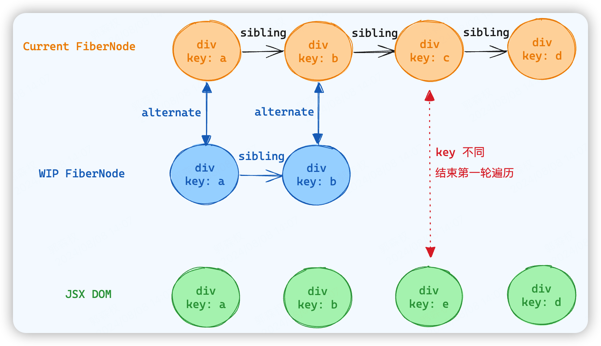
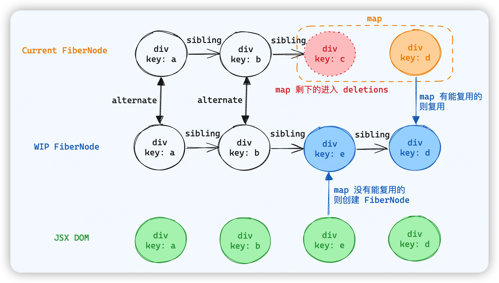

diff 发生在 **Render 阶段**，指的是 **CurrentFiberNode(旧) 和 JSX DOM(新) 做对比，然后生成新的 WorkInProgressFiberNode**

> diff 核心思想在与对新旧 Fiber 的取舍或抉择

出于性能考量，React **不会完整**对比两棵树，为了降低算法的复杂度，React 为 diff 算法设置了**三个限制**

1. **只对同级**元素进行 diff。如果一个 Dom 元素在前后两次更新中跨越了层级，那么 React 不会复用它

2. **两个不同类型**的元素会产生不同的树。比如元素从 div 变成了 p，那么 React 会**直接销毁** div **以及子孙**元素，新建 p 以及 p 对应的子孙元素

3. 开发者可以通过 `key` 来暗示哪些子元素能够保持稳定。

例如更新前

```jsx
<div>
	<p key="one">one</p>
  <h1 key="two">two</h1>
</div>
```

更新后

```jsx
<div>
  <h1 key="two">two</h1>
	<p key="one">one</p>
</div>
```

二者只是调换了位置，如果没有 key，React 就会采用限制二的原则，对这两个元素进行销毁并重新构造。如果使用了 key，那么这两个元素就会被复用

对于同级元素的 diff（限制一），整个 diff 的流程可以**分为两类**

- **更新后只有一个元素**，此时会根据新的元素创建对应的 wip FiberNode，对应的流程就是**单节点 diff**

- **更新后有多个元素**，此时会遍历新的子元素创建对应的 wip FiberNodes 以及它的兄弟元素，此时对应的流程就是**多节点 diff**

> 所谓「复用」就是将 Current FiberNode 直接作为新的 WIP FiberNode，通过 alternate 指针互相引用

## 单节点 diff

单节点指的是**新节点为单一节点**，但是旧节点的数量是不一定的

单节点 diff 是否能够复用遵循以下的流程：

- 判断 `key` 是否相同
  - 如果更新前后没有设置 key，那么 key 就是 null，也是属于相同的情况
  - 如果 key 相同，就会进入下一步
  - 如果 key 不同，就不需要进入下一步，无需判断 type，结果为**无法复用**，**继续找 current FiberNode 中的兄弟 FiberNode 进行 diff**
- 如果 key 相同，再判断 `type` 是否相同
  - type 相同，结果为复用
  - type 不同，结果为无法复用，并且兄弟节点也一并标记为删除（限制二）

**例1**

更新前（CurrentFiberTree）

```jsx
<ul>
	<li>1</li>
  <li>2</li>
  <li>3</li>
</ul>
```

更新后（JSX DOM）

```jsx
<ul>
  <p>1</p>
</ul>
```

更新后只有一个节点，走单节点 diff 流程，从 `<li>1</li>` 和 `<p>1</p>` 开始 diff

由于没有设置 key，默认 key 是相同的，接着判断 type，发现 type 不同，标记 `<li>1</li>` 为不能复用，并且其兄弟 FiberNodes 也一同标记为删除状态

> 如果上面的例子中，key 不相同，只能代表当前的 FiberNode 不能复用，还需要继续遍历兄弟 FiberNodes

**例2**

更新前（CurrentFiberTree）

```jsx
<div key="one">one</div>
```

更新后（JSX DOM）

```jsx
<div key="one">two</div>
```

key 相同，然后判断 type，也相同，这个 FiberNode 就可以复用。children 是一个文本节点，之后将文本节点更新即可

## 多节点 diff

多节点指的是**新节点有多个**

React 团队发现，在日常开发中，对节点更新操作的情况往往要多于新增、删除、移动，因为在进行多节点 diff 的时候，React 会进行两轮遍历。

- 第一轮遍历会尝试**逐个**复用节点

- 第二轮遍历处理上一轮中的**剩余**节点

### 第一轮遍历

第一轮会从前往后依次进行遍历，存在三种情况

- `key` 不同，不做任何标记或者复用，**直接结束**第一轮遍历
- 如果新旧子节点的 key 相同，但 `type` 不同，此时会根据新节点（JSX DOM）来生成一个全新的 FiberNode，旧的 Fiber 会被放到 deletions 数组中，后面统一删除，此时遍历并**不会终止**

- 如果新旧子节点的 key 和 type 都相同，说明可以复用，此时遍历并**不会终止**
- 如果新旧子节点的 key 和 type 都不相同，结束第一轮遍历

**例1** 

更新前（CurrentFiberTree）

```jsx
<div>
  <div key="a">a</div>
  <div key="b">b</div>
  <div key="c">c</div>
  <div key="d">d</div>
</div>
```

更新后（JSX DOM）

```jsx
<div>
  <div key="a">a</div>
  <div key="b">b</div>
  <div key="e">e</div>
  <div key="d">d</div>
</div>
```

首先对比 div.key.a 和 div.key.b，这两个 FiberNode 能够复用（key 和 type 都相同）

当遍历到 div.key.c 时，发现 key 对不上了，则结束第一轮遍历



**例2**

更新前（CurrentFiberTree）

```jsx
<div>
  <div key="a">a</div>
  <div key="b">b</div>
  <div key="c">c</div>
  <div key="d">d</div>
</div>
```

更新后（JSX DOM）

```jsx
<div>
  <div key="a">a</div>
  <div key="b">b</div>
  <p key="c">c</p>
  <div key="d">d</div>
</div>
```

第一轮遍历正常进行，该复用就复用。当发现 div.key.c 在更新之后 key 一致但 type 变为了 p，则会将这个 current FiberNode 放入 deletions 数组，然后取 JSX DOM 作为 WIP FiberNode，

继续第一轮遍历，直到

- 到任意一棵树的末尾

- 发现 key 不同了


### 第二轮遍历

如果第一轮遍历被提前终止了，意味着有新的 JSX DOM 或者旧的 Current FiberNode 没有遍历完，此时就会进行第二轮遍历

第二轮遍历的三种情况

- **只剩下旧**的 Current FiberNode，将旧的子节点添加到 deletions 数组中直接删除（删除）
- **只剩下新**的 JSX DOM，根据 JSX DOM 创建 FiberNode 节点作为 WIP FiberNode（新增）
- **新旧都有剩余**，会将剩余的 CurrentFiberNode 旧节点收集到一个 `map` 中，遍历剩余的 JSX DOM，从 map 中找出能够复用的就复用（移动）；如果找不到就新增；最后将 map 中剩余的 FiberNode 放到 deletions 数组中删除

继续分析上面的例1，在第一轮遍历结束后，会进行第二轮遍历，此时新旧节点均有剩余，按照上述第三种情况进行



## 双端对比算法

Vue 里面将这个流程称之为 patch，采用双端对比算法

在新旧子节点的数组中，各用两个指针指向头尾的节点，在遍历的过程中，头尾两个指针同时向中间靠拢，具体流程如下：

1. 每遍历到一个节点，就尝试进行双端比较，「新前 vs 旧前」、「新后 vs 旧后」、「

新后 vs 旧前」、「新前 vs 旧后」，如果可以复用，就进行节点的更新或移动操作。

2. 如果经过四个端点的比较，都没有可复用的节点，则将旧的子序列保存为节点， key 为 key ，index 为 value 的 map 。
3. 拿新的一组子节点的头部节点去 map 中查找，如果找到可复用的节点，则将相应的节点进行更新，并将其移动到头部，然后头部指针右移。
4. 然而，拿新的一组子节点中的头部节点去旧的一组子节点中寻找可复用的节点，并非总能找到，这说明这个新的头部节点是新增节点，只需要将其挂载到头部即可。
5. 经过上述处理，最后还剩下新的节点就批量新增，剩下旧的节点就批量删除。

Vue3 在 Vue2 Diff 逻辑的基础上，还构造了**最长递增子序列**，最大程度降低了 DOM 操作，而 React 没有使用最长递增子序列来加速 Diff 算法

> 实际上在 React 源码中，解释了为什么不使用 Vue 的双端 diff
>
> 因为 FiberNode 是**链表结构**，整个链表上**没有反向指针**，及前一个 FiberNode 通过 sibling 属性指向另一个 FiberNode，只能从前往后遍历，而不能反过来，因此该算法无法通过双端搜索来进行优化，因为双端 diff 需要向前查找节点这一动作。不过以后会考虑

