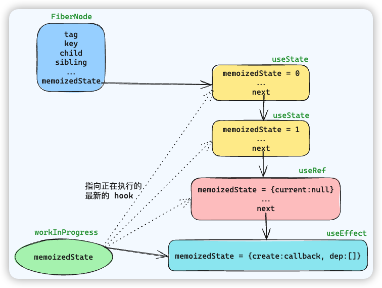

# Hooks 原理

## Hook 内部介绍

Hook 是一个**对象**，一个组件中的 hook 会**以链表的形式串联**起来，**头节点**会以 `memoizedState` 属性保存在 FiberNode 中。数据结构如下

```js
const hook = {
	memoizedState: null,
	baseState: null,
	baseQueue: null,
	queue: null,
	next: null
}
```

注意 `FiberNode.memoizedState` 保存的是 Hook 链表中的**头节点**，而 Hook 中的 `memoizedState` 保存的是当前 hook 自身的数据。不同类型的 hook，`memoizedState` 所存储的内容也是不同的：

- `useState`：对于 `const [state, setState] = useState(initialState)`，memoizedState 存储的是 `state` 的值
- `useReducer`：对于 `const [state, dispatch] = useReducer(reducer, {})`，memoizedState 存储的是 `state` 的值
- `useEffect`：对于 `useEffect(callback, [...deps])` ，memoizedState 存储的是 `{ create:callback, deps: [] }`  等数据
- `useRef`：对于 `useRef(value)`，memoizedState 存储的是 `{ current: value }` 等数据
- `useMemo`：对于 `useMemo(callback, [...deps]`，memoizedState 存储的是 `[callback(), [...deps]]` 等数据
- `useCallback`：对于 `useCallback(callback, [...deps]`，memoizedState 存储的是 `[callback, [...deps]]` 等数据

在 React 中，针对 Hook 有**三种策略（方法集合）**，或者说三种类型的 `dispatcher` 集合

- `HooksDispatcherOnMount`：负责**初始化**工作，让函数组件的一些初始化信息挂载到 Fiber 上面

```js
const HooksDispatcherOnMount = {
	useCallback: mountCallback,
	useEffect: mountEffect,
	useMemo: mountMemo,
	// ...
}
```

- `HooksDispatcherOnUpdate`：函数组件进行**更新**的时候，会执行该对象所对应的方法，此时 Fiber 上面已经存储了函数组件的相关信息，这些 Hook 需要做的就是去获取或者更新维护这些 Fiber 的信息

```js
const HooksDispatcherOnUpdate = {
	useCallback: updateCallback,
	useContext: readContext,
	useState: updateState,
	// ...
}
```

- `ContextOnlyDispatcher`：与**报错**相关，防止开发者在函数组件外部调用 Hook

```js
const ContextOnlyDispatcher = {
	useCallback: throwInvalidHookError,
	useEffect: throwInvalidHookError,
	// ...
}
```

当 FC 进入到 Render 阶段时，首先会判断是初次渲染还是更新（通过 current 是否存在），接着会给 ReactCurrentDispatcher.current 赋值对应的 dispatcher

```js
if(current !== null && current.memoizedState !== null) {
	ReactCurrentDispatcher.current = HooksDispatcherOnUpdate
} else {
	ReactCurrentDispatcher.current = HooksDispatcherOnMount
}
```

## Hook 的执行流程

当 FC 进入到 Render 阶段时，会被 `renderWithHooks` 函数处理执行，该函数首先清空 workInProgress 的 memoizedState 以及 updateQueue，根据所处阶段初始化 ReactCurrentDispatcher.current，之后调用 Component 方法来执行函数组件，组件中的 hooks 就会依次执行。

以 useState 为例

```jsx
function App() {
	const [count, setCount] = useState(0)
	return <div onClick={() => setCount(count + 1)}>{count}</div>
}
```

mount 阶段调用的是 `mountState`

```ts
function mountState<S>(
  initialState: (() => S) | S,
): [S, Dispatch<BasicStateAction<S>>] {
  // 1. 创建 hook 对象，初始化 hook.memoizedState、hook.baseState、hook.queue
  // 得到 hook 对象链表
  const hook = mountStateImpl(initialState);
  const queue = hook.queue;
  // 2. 设置 hook.dispatch 的属性
  const dispatch: Dispatch<BasicStateAction<S>> = (dispatchSetState.bind(
    null,
    currentlyRenderingFiber,
    queue,
  ): any);
  queue.dispatch = dispatch;
  // 返回[当前状态, dispatch 函数]
  return [hook.memoizedState, dispatch];
}
```

对于如下组件

```jsx
function App() {
  const [number, setNumber] = useState(0)
  const [num, setNum] = useState(1)
  const dom = useRef(null)
  useEffect(() => {
    console.log(dom.current)
  }, [])
  return (
  	<div ref={dom}>{...}</div>
  )
}
```

当上面的函数组件第一次初始化后，就会形成一个 hook 的链表



更新时，会执行 updateXXX 方法，它们都会通过 `updateWorkInProgressHook` 方法来获取当前的 hook 对象

```ts
function updateWorkInProgressHook(): Hook {
  // 假设一定有一个 current hook 节点对象供克隆，或者一个 wip hook 节点对象供我们复用
  let nextCurrentHook: null | Hook;
  if (currentHook === null) {
    const current = currentlyRenderingFiber.alternate;
    if (current !== null) {
      nextCurrentHook = current.memoizedState;
    } else {
      nextCurrentHook = null;
    }
  } else {
    nextCurrentHook = currentHook.next;
  }

  let nextWorkInProgressHook: null | Hook;
  if (workInProgressHook === null) {
    nextWorkInProgressHook = currentlyRenderingFiber.memoizedState;
  } else {
    nextWorkInProgressHook = workInProgressHook.next;
  }

  if (nextWorkInProgressHook !== null) {
    workInProgressHook = nextWorkInProgressHook;
    nextWorkInProgressHook = workInProgressHook.next;

    currentHook = nextCurrentHook;
  } else {
    // Clone from the current hook.

    if (nextCurrentHook === null) {
      const currentFiber = currentlyRenderingFiber.alternate;
      if (currentFiber === null) {
        // This is the initial render. This branch is reached when the component
        // suspends, resumes, then renders an additional hook.
        // Should never be reached because we should switch to the mount dispatcher first.
        throw new Error(
          'Update hook called on initial render. This is likely a bug in React. Please file an issue.',
        );
      } else {
        // This is an update. We should always have a current hook.
        throw new Error('Rendered more hooks than during the previous render.');
      }
    }

    currentHook = nextCurrentHook;

    const newHook: Hook = {
      memoizedState: currentHook.memoizedState,

      baseState: currentHook.baseState,
      baseQueue: currentHook.baseQueue,
      queue: currentHook.queue,

      next: null,
    };

    if (workInProgressHook === null) {
      // This is the first hook in the list.
      currentlyRenderingFiber.memoizedState = workInProgressHook = newHook;
    } else {
      // Append to the end of the list.
      workInProgressHook = workInProgressHook.next = newHook;
    }
  }
  return workInProgressHook;
}

```

该函数的目的是管理 hook 的生命周期：根据当前渲染状态**复用或创建**新的 hook，并确保它们按顺序正确地与工作中的 Fiber 节点关联起来。这是 React 如何保持函数组件状态一致性的关键部分。

> 这也就解释了为什么 hook 不能在条件或循环语句中执行
>
> React 内部为了保存 useState、useEffect 这样的 hooks 的顺序和状态，每个组件会维护一个 hooks 链表。这个链表的维护逻辑完全依赖于 hooks 调用的顺序。每次组件重新渲染时，React 都会从头开始遍历这个链表，每个 hook 的调用都会取出链表中对应的一项。
>
> 理解这一点，我们就能明白为什么 hooks 不能在条件语句或循环中使用了：
>
> 1. **条件语句**: 如果我们把 hook 放在条件语句中，那么其是否执行就依赖于条件语句是否为真。如果条件在不同的渲染阶段有不同的结果，那么 hooks 的执行顺序就会发生改变，对应的状态就无法正确关联，导致混乱的问题。
> 2. **循环语句**: 如果在循环中使用 hook，那么每一次的循环可能会运行不同次数的 hook。这也会导致 React 无法正确地对应 hook 和它们的状态，因为它期望的是一次渲染中 hook 的数量和调用顺序是固定的。
>
> React 规定 hooks 需要在组件的**最顶层调用**，且调用顺序须在每次渲染时都保持一致，这是为了 React 能正确地保存和找到每个 hook 的状态。如果违反了这一点，React 无法保证应用状态的正确性，也就无法保证应用的正确运行。