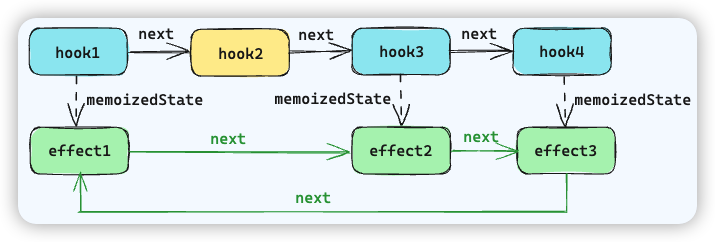

# Effect 相关 hook

## 综述

在 React 中，用于定义副作用逻辑的 hook 有三个

- `useEffect`：回调函数会在 **commit 阶段完成后异步执行**，所以它**不会阻塞**视图渲染

- `useLayoutEffect`：回调函数会在 **commit 阶段的 Layout 子阶段**同步执行，一般用于**执行 DOM** 相关的操作

- `useInsertionEffect`：回调函数会在 **commit 阶段的 Mutation 子阶段**同步执行，与 useLayoutEffect 的区别在于执行的时候无法访问对 DOM 的引用，这个 Hook 是专门为 `CSS-In-JS` 库插入全局 style 元素而设计的

## 数据结构

三个 effect 相关的 hook，其 `hook.memoizedState` 共用一套数据结构

```js
const effect = {
	// 用于区分 effect 的类型 Passive | Layout | Insertion
	tag,
	// effect 回调
	create,
	// effect 实例，保存销毁方法 { destory: () => void }
	inst,
	// 依赖项
	deps,
	// 与当前组件的全部 effect hook 节点的 memoizedState 对象形成环状链表
	next: null
}
```

环状链表示意



## 工作流程

以上三个 hook 工作流程可以分为三个阶段：**声明阶段、调度阶段和执行阶段**

### 声明阶段

`mount` 的时候执行 `mountEffectImpl` 方法，创建 hook 对象，保存依赖数组，修改当前 fiber 的 flags，最后将该节点的数据处理为环状链表节点，保存在当前 hook 对象的 memoizedState 属性中。

`update` 的时候执行 `updateEffectImpl` 方法

```ts
function updateEffectImpl(
  fiberFlags: Flags,
  hookFlags: HookFlags,
  create: () => (() => void) | void,
  deps: Array<mixed> | void | null,
): void {
  // 拿到之前的 hook 对象
  const hook = updateWorkInProgressHook();
  // 拿到依赖项
  const nextDeps = deps === undefined ? null : deps;
  const effect: Effect = hook.memoizedState;
  const inst = effect.inst;

  // currentHook is null on initial mount when rerendering after a render phase
  // state update or for strict mode.
  if (currentHook !== null) {
    if (nextDeps !== null) {
      // 获取到之前 hook 对象的依赖数组
      const prevEffect: Effect = currentHook.memoizedState;
      const prevDeps = prevEffect.deps;
      // 使用浅比较的方式
      // 如果依赖项没有变化，则复用之前的 effect hook 对象，给这个对象打上 HookPassive 的 flag
      // 组件渲染后会忽略这个 Effect 的执行
      if (areHookInputsEqual(nextDeps, prevDeps)) {
        hook.memoizedState = pushEffect(hookFlags, create, inst, nextDeps);
        return;
      }
    }
  }
	
  // 如果发生变化，那么给 fiber 打上 effectFlag，在 commit 后就会异步执行这个 effect 回调
  currentlyRenderingFiber.flags |= fiberFlags;

  // pushEffect 的作用就是将当前 effect 添加到 FiberNode 的 updateQueue 中，然后返回这个当前 effect
  // 并将这个 effect 对象保存到当前 hook 对象的 memoizedState 属性中
  hook.memoizedState = pushEffect(
    HookHasEffect | hookFlags,
    create,
    inst,
    nextDeps,
  );
}
```

### 调度阶段（useEffect 独有）

因为 useEffect 的回调函数会在 commit 阶段完成后异步执行，因此需要参与到调度器的调度阶段

### 执行阶段

执行阶段涉及到两个相关的方法

- `commitHookEffectListUnmount` 用于遍历 effect 链表依次执行 `effect.inst.destory` 方法

- `commitHookEffectListMount` 用于遍历 effect 链表依次执行 `effect.create` 方法，根据声明阶段的 tag 判断是否跳过本次执行

每次执行都会**先执行 destory 再执行 create**