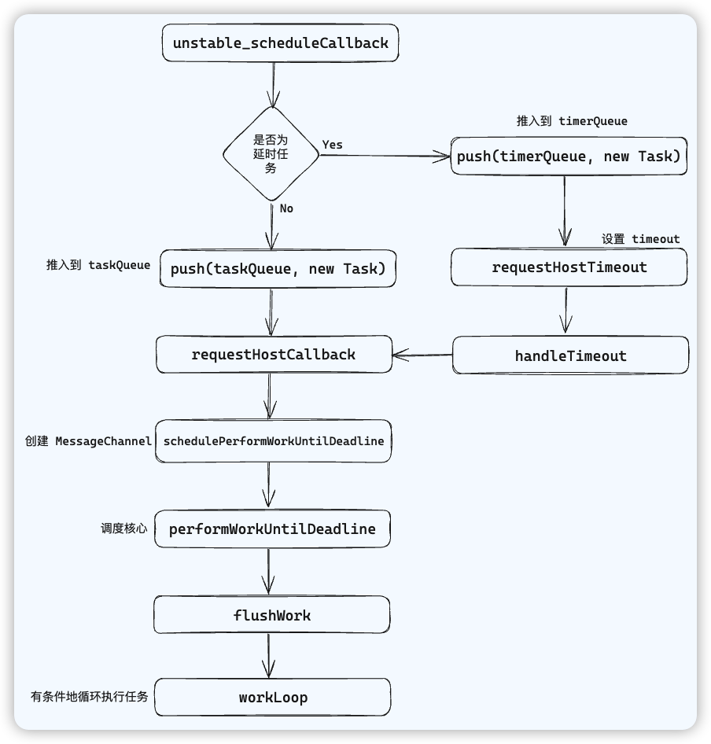

# Scheduler调度延时任务

延时任务的调度主要是由 `requestHostTimeout` 函数开启的

## [requestHostTimeout](https://github.com/facebook/react/blob/main/packages/scheduler/src/forks/Scheduler.js#L556)

```ts
function requestHostTimeout(
  callback: (currentTime: number) => void,
  ms: number,
) {
  taskTimeoutID = localSetTimeout(() => {
    callback(getCurrentTime());
  }, ms);
}
```

`requestHostTimeout` 实际上就是设置了一个 `setTimeout`，当 setTimeout 延时到达后，调用传入的 handleTimeout 方法，将这个任务交由 React 调度器来处理

## [handleTimeout](https://github.com/facebook/react/blob/main/packages/scheduler/src/forks/Scheduler.js#L127)

```js
function handleTimeout(currentTime: number) { // 接收当前时间
  isHostTimeoutScheduled = false;
  // 遍历 timerQueue，将时间已经到了的延时任务放入 taskQueue
  advanceTimers(currentTime);

  if (!isHostCallbackScheduled) {
    if (peek(taskQueue) !== null) {
      // 检查普通任务队列是否还有任务
      isHostCallbackScheduled = true;
      // 使用调度普通任务的方式开启任务调度
      requestHostCallback();
    } else {
      // 普通任务队列是空的，就去 timerQueue 取一个任务出来
      const firstTimer = peek(timerQueue);
      if (firstTimer !== null) {
        // 使用调度延时任务的方式开启任务调度
        requestHostTimeout(handleTimeout, firstTimer.startTime - currentTime);
      }
    }
  }
}
```

handleTimeout 被调用后，首先检查 timerQueue 中有无延时已经到了的延时任务，有的话放入 `taskQueue`

然后检查此时 taskQueue 中有无普通任务，有则继续调用 `requestHostCallback` 开启普通任务调度

如果普通任务队列是空的，就去 timerQueue 中取出一个任务，使用 `requestHostTimeout` 开启延时任务调度

## Scheduler 核心流程图



