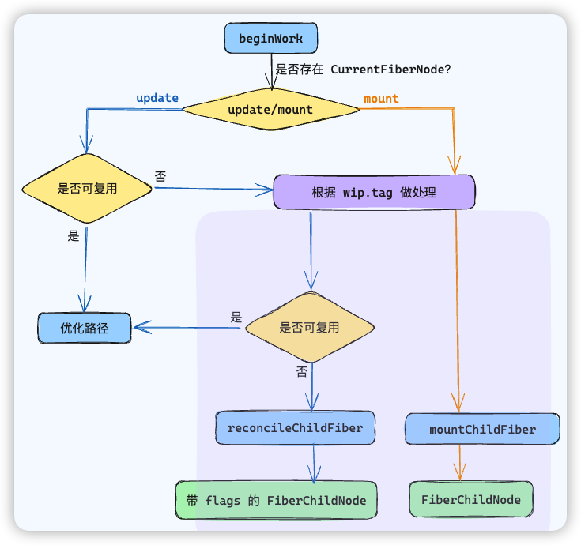

# beginWork

`Reconciler` 协调器是 `Render` 阶段的第二部分工作，主要是负责比较当前组件树和新的组件树（由组件状态或属性变化产生），然后计算出实际DOM需要更新的最小变化集。整个工作的过程可以分为「递」和「归」，分别对应 `beginWork` 方法和 `completeWork` 方法

`beginWork` 主要是根据传入的 `FiberNode`，创建**下一级**的 `FiberNode`，整个工作流程如下图所示

> 优化路径主要包括 eagerState 和 bailout 策略，根据状态与 props 决定是否跳过某个执行阶段，从而提高渲染效率



## 判断当前流程

首先，根据 currentFiberNode 是否存在来判断当前属于 mount 流程还是 update 流程

```js
if (current !== null) {
	// 说明 CurrentFiberNode 存在，此时为 update 流程
} else {
	// 此时为 mount 流程
}
```

如果是 update 流程，接下来会判断 `wipFiberNode` 是否能复用，如果不能复用，那么 update 与 mount 流程基本一致

- 根据 `wipFiberNode.tag` 进行不同的分支处理
- 根据 reconcile 算法（diff）生成下一级的 FiberNode

无法复用的 update 流程和 mount 流程大体一致，主要区别在于是否会生成带有副作用标记 flags 的 FiberNode

## 根据 tag 做处理

`beginWork` 方法的代码结构如下，可以看作是一个**巨大的switch语句**，根据 Fiber 节点的类型（即`workInProgress.tag`）执行不同的逻辑。

```js
function beginWork(current, workInProgress, renderLanes) {
  // ...
  if(current !== null) {
    // 更新
  } else {
    // 首次渲染
  }
  
  // 根据不同的 tag，进入不同的处理逻辑
  switch (workInProgress.tag) {
    case IndeterminateComponent:
      // ...
    case FunctionComponent:
      // ...
    case ClassComponent:
      // ...
  }
}
```

## 关于 tag

`tag` 属性用来区分 **Fiber 的类型**，比如：是class组件( `ClassComponent` )、函数组件( `FunctionComponent` )、宿主组件（如`div`、`span`等DOM元素，对应`HostComponent`），或者其他类型，指示 React **对于元素的正确处理方式**。

React 源码定义了 28 种 tag：

```js
export const FunctionComponent = 0;
export const ClassComponent = 1;
export const HostRoot = 3; // Root of a host tree. Could be nested inside another node.
export const HostPortal = 4; // A subtree. Could be an entry point to a different renderer.
export const HostComponent = 5;
export const HostText = 6;
export const Fragment = 7;
export const Mode = 8;
export const ContextConsumer = 9;
// ...
```

React 在 19.0 删除了 IndeterminateComponent tag

## 处理 FiberNode

在处理不同 tag 的 FiberNode 过程中，最终会根据是 update 还是 mount 调用两个不同的方法 `reconcileChildFibers` 和 `mountChildFibers`

这两个方法都是一个叫 `ChildReconciler` 方法的返回值

```js
var reconcileChildFibers = ChildReconciler(true)
var mountChildFibers = ChildReconciler(false)

function ChildReconciler(shouldTrackSideEffects) {}
```

其中，`shouldTrackSideEffects` 是一个布尔值，表示是否需要追踪副作用，从而给 Fiber 做 `flag` 标记

```js
if(!shouldTrackSideEffects) {
	newFiber.flags |= Forked
	return lastPlacedIndex
}
newFiber.flags |= Placement
```

## 标记 flag

在`beginWork`方法中，React 根据**当前Fiber节点及其子节点的比较结果**，为它们设置合适的`flags`，以便后面的渲染过程知道如何正确地更新DOM

`beginWork` 所标记的 `flags` 主要与元素的**位置**有关，包括：

- 标记 `ChildDeletion`，如果Fiber节点被删除，它会被标记为`Deletion`，表示在提交阶段它应从DOM中移除
- 标记 `Placement`，如果一个新的Fiber节点被创建，它会被标记为`Placement`，意味着在提交阶段它需要被插入到DOM中
- 标记 `Update`，如果 Fiber 节点在比较前后的 props 或 state 时检测到变化，会被标记为`Update`，表示它在提交阶段需要更新。

## 总结

`beginWork` 对**当前所处流程**是 `mount` 还是 `update` 有着不一样的流程

如果当前的流程是 `update`，则 `WorkInProgressFiberNode` 存在对应的 `CurrentFiberNode`，接下来就判断是否能够复用

如果无法复用 CurrentFiberNode，那么 mount 和 update 的流程大体上是一致的

- 根据 `wip.tag` 进入不同类型元素的处理分支
- 在处理过程中使用 reconcile 算法生成下一级 FiberNode

两个流程在处理中的区别在于**最终是否会为生成的子 FiberNode 标记副作用 flags**，最终会调用两个不同的函数

在 `beginWork` 中，标记的副作用的 `flags` 主要与**元素的位置**有关，包括

- 标记 `ChildDeletion`，代表删除操作
- 标记 `Placement`，代表插入或移动操作