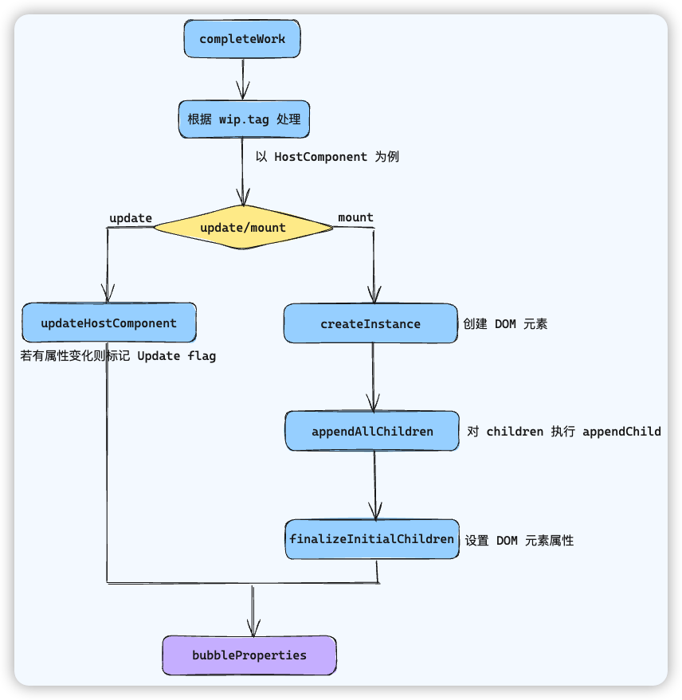

# completeWork工作流程

为每个 Fiber 节点**完成渲染准备**，包括**处理每个节点的 DOM 更新逻辑**和**收集本次更新过程中所有子节点的副作用**

与 beginWork 类似，`completeWork` 也会根据 `wip.tag` 区分对待，流程上面主要包括两个步骤

- 创建元素或标记元素的更新
- flags 冒泡，收集副作用



## mount 过程

以 `HostComponent` 为例

首先会通过 `createInstance` 创建 FiberNode 所对应的 DOM 元素

接下来会执行 `appendAllChildren`  函数，通过一个循环，深度优先遍历了`workInProgress`节点的所有子孙 Fiber 节点，并且将找到的所有 DOM 元素附加到了父节点上。通过这一过程，React 构建了实际的 DOM 结构。这个函数是在渲染阶段中，**处理 DOM 节点**的**低层次**操作，以确保组件树结构正确映射到浏览器的 DOM 结构中（因为 FiberTree 的结构层次和最终 DOMTree 的结构层次可能有区别）。

```js
appendAllChildren = function(parent, workInProgress, ...) {
  let node = workInProgress.child
  
  while(node !== null) {
    if(node.tag === HostComponent || node.tag === HostTest) {
      appendInitialChild(parent, node.stateNode)
    } else if(node.child !== null) {
      node.child.return = node
      node = node.child
      continue
    }
    if(node === workInProgress) {
      return
    }
    while(node.sibling === null) {
      if(node.return === null || node.return === workInProgress) {
        return
      }
      node = node.return
    }
    node.sibling.return = node.return
    node = node.sibling
  }
}
```

接下来会执行 `finalizeInitialChildren` 方法完成**属性的初始化**，主要包含以下几类属性

- styles，对应的方法为 setValueForStyles 
- innerHTML，对应的方法为 setInnerHTML 
- 文本类型 children，对应 setTextContent 方法
- 不会再在 DOM 中冒泡的事件，包括 cancel、close、invalid、load、scroll、toggle
- 其他属性，对应的是 setValueForProperty 方法

最后执行 `bubbleProperties` 完成 flags 冒泡

## update 过程

上面的 mount 流程，完成的是属性的初始化，那么 update 流程，则负责属性更新的标记

`updateHostComponent` 的主要逻辑是在 `diffProperties` 方法中，这个方法包含两次遍历

- 第一次主要是标记**删除**了的属性
- 第二次主要是标记**更新**了的属性

所有更新了的属性的 key value 会保存在当前 FiberNode 的 `updateQueue` 属性中

```js
['title', '1', 'style', { 'color': '#111' }]
```

然后修改当前 FiberNode 的 `flag`

```js
workInProgress.flags |= Update
```

最后执行 `bubbleProperties` 完成 flags 冒泡

## flags 冒泡

当整个 Reconciler 完成工作后，会得到一颗完整的 wipFiberTree，这棵树的 FiberNode 有些有 flag 标记，有些没有

如何**高效的**查找到这颗树中带有 flag 标记的 FiberNode 呢？

将所有子孙节点的 flags 都放到当前 FiberNode 的 `subtreeFlags` 属性中

```js
let subtreeFlags = NoFlags

// 收集了 FiberNode 的子孙 node 标记的 flags
subtreeFlags |= child.subtreeFlags
// 收集了 FiberNode 中标记的 flags
subtreeFlags |= child.flags
// 将收集到的所有 flags 附加到当前 FiberNode 的 subtreeFlags 属性中
completeWork.subtreeFlags |= subtreeFlags
```

## 总结

completeWork 会根据 wip.tag 区分对待，流程大体上包括如下的两个步骤

- 创建元素（mount）或者标记元素更新（update）
- flags 冒泡

completeWork 在 mount 时的流程如下

- 根据 wip.tag 进入不同的处理分支
- 以 HostComponent 为例，首先执行 createInstance 方法来创建对应的 DOM 元素
- 执行 appendAllChildren 将下一级 DOM 元素挂载在上一步所创建的 DOM 元素下
- 执行 finializeInitialChildren 完成属性初始化
- 执行 bubbleProperties 完成 flags 冒泡

completeWork 在 update 时主要是标记属性的更新

updateHostComponent 的主要逻辑是在 diffProperties 方法中，该方法包括两次遍历

- 第一次遍历，标记删除”更新前有，更新后没有“的属性
- 第二次遍历，标记更新”更新前后发生改变“的属性

无论是 mount 还是 update，最终**都会进行 flags 冒泡**

flags 冒泡的目的是为了找到散落在 WorkInProgressFiberTree 各处的被标记了副作用的 FiberNode，把它们挂到父节点的 `subtreeFlags` 上，方便后续对副作用的处理