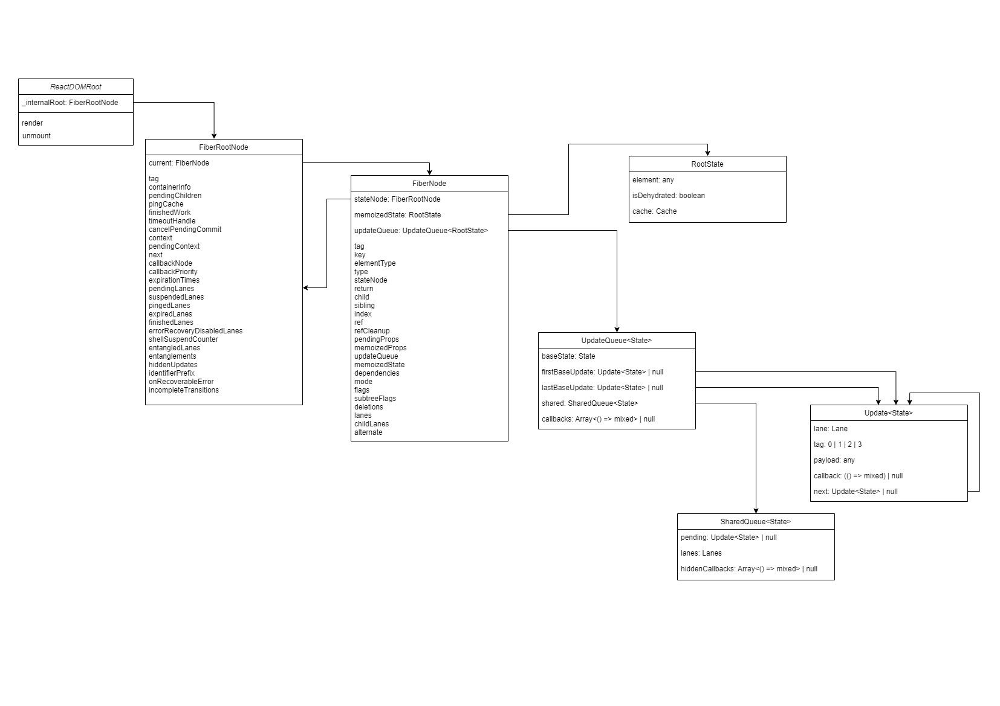

> https://incepter.github.io/how-react-works/docs/react-dom/how.createroot.works

# createRoot 工作原理

使用 React 时，第一步就是导入 `react-dom/client` 包的 `createRoot` 方法，通过传入 `container` 来调用它，得到返回的 `root` 对象，最后利用 `root.render` 方法渲染 React 组件

```jsx
import { App } from "./app";
import { createRoot } from "react-dom/client";

const container = document.getElementById("root");

// This is the first step
const root = createRoot(container);

// Then, the second
root.render(<App />);
```

本节我们将讨论关于 `createRoot` 的全部内容，包括函数签名、内部逻辑等

## 签名

createRoot [定义](https://github.com/facebook/react/blob/e50531692010bbda2a4627b07c7c810c3770a52a/packages/react-dom/src/client/ReactDOM.js#L115)如下

```js
function createRoot(
  container: Element | Document | DocumentFragment,
  options?: CreateRootOptions
): RootType { /* [Not Native code] */ }
```

`createRoot` 接受一个 DOM 节点并返回一个类型为 `RootType`  （dom 节点通常称为 `HostRoot` ） 的对象，我们将使用该对象来渲染应用程序。

第二个参数是可选的配置项，包括一些处于试验阶段的配置项，例如 unstable_strictMode、unstable_concurrentUpdatesByDefault、identifierPrefix、onRecoverableError 等

## 实现

### 1 校验 container 

确保 container 是一个有效的 React 容器

```js
if (!isValidContainer(container)) {
  throw new Error('createRoot(...): Target container is not a DOM element.');
}
```

有效的容器[包括](https://github.com/facebook/react/blob/80d9a40114bb43c07d021e8254790852f450bd2b/packages/react-dom/src/client/ReactDOMRoot.js#L347)：

- DOM 元素，如 `div`、`p` 等
- [DocumentFragment API](https://developer.mozilla.org/zh-CN/docs/Web/API/DocumentFragment) 创建的元素
- [Commit API](https://developer.mozilla.org/en-US/docs/Web/API/Comment) 创建的数据
- 主页面的 document 对象

### 2 [警告](https://github.com/facebook/react/blob/80d9a40114bb43c07d021e8254790852f450bd2b/packages/react-dom/src/client/ReactDOMRoot.js#L191C3-L191C31)不合格的容器

在开发环境下，如果违反以下条件之一，可能会得到警告

- 使用 body 元素作为 container
- 使用之前使用过的 container
- You previously called the legacy `ReactDOM.render(container, element)` on that `container`.

### 3 处理 options 配置

开发环境下使用传入的配置[覆盖](https://github.com/facebook/react/blob/80d9a40114bb43c07d021e8254790852f450bd2b/packages/react-dom/src/client/ReactDOMRoot.js#L199)默认配置

```js
// simplified
let isStrictMode = false;
let identifierPrefix = '';
// ...other options

if (options) {
  if (options.unstable_strictMode === true) {
    isStrictMode = true;
  }
  if (options.identifierPrefix !== undefined) {
      identifierPrefix = options.identifierPrefix;
  }
  // ...
}
```

### 4 调用 createContainer

使用上面处理好的配置参数，传入 `createContainer` 方法创建 `fiberRoot` 对象

```js
const fiberRoot = createContainer(
  container, // the host element
  ConcurrentRoot, // the root type, or RootTag
  null, // hydration callbacks
  isStrictMode, // options?.unstable_strictMode || false
  isConcurrentUpdatesByDefault,  // options?.unstable_concurrentUpdatesByDefault || false
  identifierPrefix, // options?.identifierPrefix || ''
  onRecoverableError, // options?.onRecoverableError || reportError || console.error
  transitionCallbacks, // options?.unstable_transitionCallbacks || null
);
```

createContainer 方法内部将参数几乎原封不动传给 `createFiberRoot` 方法，下面分析 `createFiberRoot` 方法的[执行过程](https://github.com/facebook/react/blob/fc801116c80b68f7ebdaf66ac77d5f2dcd9e50eb/packages/react-reconciler/src/ReactFiberRoot.js#L130)

1. 创建 `FiberRootNode` 实例

```js
const fiberRoot = new FiberRootNode(
  container, // the host element
  tag, // ConcurrentRoot
  hydrate, // false for this path
  identifierPrefix, // options?.identifierPrefix || ''
  onRecoverableError, // options?.onRecoverableError || reportError || console.error
);
```

2. 创建第一个 Fiber 实例

我们都听说过 React 中著名的 Fiber 架构，此时，第一个 `FiberNode` 已经被创建

首先要确定的是 React 的[模式](https://github.com/facebook/react/blob/254cbdbd6d851a30bf3b649a6cb7c52786766fa4/packages/react-reconciler/src/ReactTypeOfMode.js#L12)，React 将使用它来决定多种情况下的执行逻辑

```js
// simplified
 const unitializedFiber = new FiberNode(
  HostRoot, // tag
  null, // pendingProps
  null, // key
  mode, // deduced react mode (strict mode, strict effects, concurrent updates..)
);
```

到目前为止，我们已经经历了两个重要节点的创建过程：FiberRootNode 和 FiberNode。重要的是，我们的心智模型开始理解，当 React 创建 root 对象时，我们创建了一个特殊的实例： FiberRootNode，同时也会有一个附加的 FiberNode 实例被创建

3. `FiberNode` 与 `FiberRootNode` 相互引用

FiberNode 作为 FiberRootNode 的 current 属性；FiberRootNode 作为 FiberNode 的 stateNode 属性

```js
fiberRoot.current = unitializedFiber;
unitializedFiber.stateNode = fiberRoot;
```

4. 初始化 FiberNode 的 `memoizedState`

```js
// simplified
uninitializedFiber.memoizedState = {
  element: null, // initialChildren
  isDehydrated: false, // hydrate
  cache: null, // put behind a feature flag
}
```

5. 初始化 FiberNode 的 `updateQueue`

这个[初始化过程](https://github.com/facebook/react/blob/4bbac04cd3624962900bb7800ba4f9609d3a1fd3/packages/react-reconciler/src/ReactFiberClassUpdateQueue.js#L175)为我们的 unintializedFiber 创建了 `updateQueue` 属性

```js
unitializedFiber.updateQueue = {
  baseState: fiber.memoizedState, // we just created this above
  firstBaseUpdate: null,
  lastBaseUpdate: null,
  shared: {
    pending: null,
    lanes: NoLanes, // 0
    hiddenCallbacks: null,
  },
  callbacks: null,
};
```

6. 最后，返回 FiberNode

```js
return fiberRoot;
```

### 5 将 container 标记为 root

在这一步，React 将通过添加一个特殊的属性来处理 container 对象，该属性对于React 实例的[加载过程](https://github.com/facebook/react/blob/b55d31955982851284bb437a5187a6c56e366539/packages/react-dom-bindings/src/client/ReactDOMComponentTree.js#L72)是唯一的。该属性的值为上一步创建的 `unintializedFiber`，即第一个 FiberNode 实例

```js
// simplified
container.__reactContainer$randomValue = fiberRoot.current; // unintializedFiber
```

### 6 注入 ReactDOMClientDispatcher

React 中关于 Dispatcher 的内容比较多，后续文章会详细讨论

```
Dispatcher.current = ReactDOMClientDispatcher;
```

### 7 监听 container 支持的全部事件

React 实现了自己的事件处理系统

此时，React 会以不同的优先级将必要的事件处理程序[附加](https://github.com/facebook/react/blob/fda1f0b902b527089fe5ae7b3aa573c633166ec9/packages/react-dom-bindings/src/events/DOMPluginEventSystem.js#L406)到 container 上

### 8 返回一个 ReactDOMRoot 的实例

这是 createRoot 的最后一步，此步骤仅返回一个基于 fiberRoot 对象调用 ReactDOMRoot 的构造函数创建的实例

构造函数本身将 fiberRoot 作为 `_internalRoot` 属性，而 [render](https://github.com/facebook/react/blob/80d9a40114bb43c07d021e8254790852f450bd2b/packages/react-dom/src/client/ReactDOMRoot.js#L102) 和 unmount 方法是挂载到原型上的

```js
function ReactDOMRoot(internalRoot: FiberRoot) {
  this._internalRoot = internalRoot;
}

ReactDOMRoot.prototype.render = ... /* [Not Native Code] */
ReactDOMRoot.prototype.unmout = ... /* [Not Native Code] */
```

```js
return new ReactDOMRoot(fiberRoot)
```

## 总结

createRoot API 主要做了如下事情：

1. 校验容器
2. 整合 options 参数
3. 调用 `createContainer` 方法（内部调用了 `createFiberRoot` 方法），基于 container 元素创建了 FiberRoot 对象以及第一个 Fiber 节点（作为 FiberRoot 的 current 属性），并初始化 Fiber 的 `memoizedState` 和 `updateQueue` 属性
4. container 添加唯一属性标记，值为 FiberRoot 的 current
5. 注入全部支持的事件监听器
6. 返回 `ReactDOMRoot(fiberRoot)`

下图为 createRoot 创建节点的结构图及部分属性



到目前为止，我们已经创建了 `FiberRoot` 对象，该对象将允许我们在给定的 dom 元素中呈现我们的应用程序 。

在下一节中，我们将讨论 `root.render()` 工作原理。
